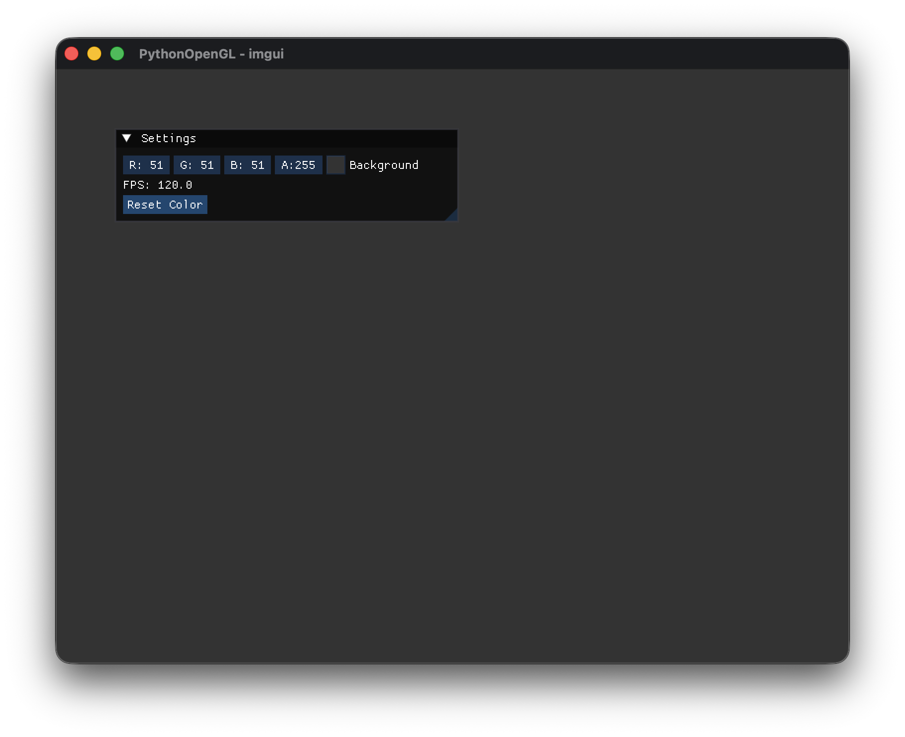
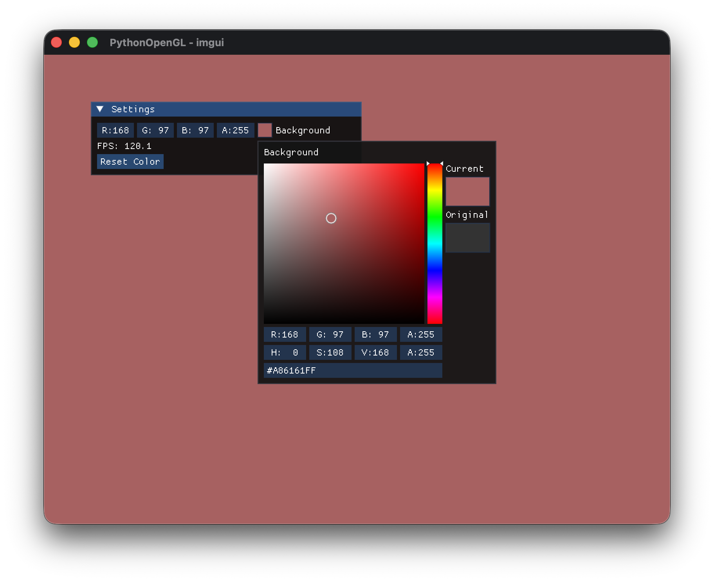

# GitHub Copilotと作る Pythonで OpenGL 3Dプログラミング

## 第3回「imguiを組み込む」

[:contents]

### はじめに

前回は、GLFWを使ってOpenGLウィンドウを作成しました。

今回は、**imgui**（Dear ImGui）を組み込んで、リアルタイムにパラメータを調整できるデバッグUIを追加します。imguiを使うことで、背景色の変更やFPSの表示など、インタラクティブな操作が可能になります。

### imguiとは

**Dear ImGui**は、ゲームやツール開発で広く使われている即時モード（Immediate Mode）のGUIライブラリです。

特徴：
- **軽量・高速**: 描画のオーバーヘッドが小さい
- **即時モード**: 状態管理が不要で、毎フレームUIを記述する
- **デバッグ向け**: パラメータ調整やデバッグ情報の表示に最適
- **カスタマイズ性**: テーマやスタイルを自由に変更可能

Pythonでは**imgui-bundle**パッケージを使用します。これはDear ImGuiのPythonバインディングで、OpenGLやGLFWとの統合機能も含まれています。

### imguiの基本構造

imguiを使ったプログラムは、以下の流れで動作します：

1. **初期化**: imguiコンテキストとレンダラーの作成
2. **フレーム開始**: 新しいフレームの開始を宣言
3. **UI描画**: ウィジェット（ボタン、スライダーなど）を配置
4. **レンダリング**: UIを実際に描画
5. **終了処理**: リソースの解放

### サンプルコード

`src/main.py`を以下の内容に更新します：

```python
"""
PythonOpenGL - Phase 3: imgui基礎
"""
# imgui_bundleをglfwより先にインポート（GLFWライブラリの重複警告を回避）
from imgui_bundle import imgui
from imgui_bundle.python_backends.glfw_backend import GlfwRenderer

import glfw
from OpenGL.GL import (
    glClear,
    glClearColor,
    glViewport,
    GL_COLOR_BUFFER_BIT,
)


def main() -> None:
    """メイン関数"""
    # GLFWの初期化
    if not glfw.init():
        raise RuntimeError("GLFWの初期化に失敗しました")

    try:
        # OpenGLバージョンの指定（3.3 Core Profile）
        glfw.window_hint(glfw.CONTEXT_VERSION_MAJOR, 3)
        glfw.window_hint(glfw.CONTEXT_VERSION_MINOR, 3)
        glfw.window_hint(glfw.OPENGL_PROFILE, glfw.OPENGL_CORE_PROFILE)
        glfw.window_hint(glfw.OPENGL_FORWARD_COMPAT, True)  # macOSで必要

        # ウィンドウの作成
        window = glfw.create_window(800, 600, "PythonOpenGL - imgui", None, None)
        if not window:
            raise RuntimeError("ウィンドウの作成に失敗しました")

        # OpenGLコンテキストを現在のスレッドに設定
        glfw.make_context_current(window)

        # imguiの初期化
        imgui.create_context()
        impl = GlfwRenderer(window)

        # 背景色（RGBA、0.0〜1.0）
        clear_color = [0.2, 0.2, 0.2, 1.0]

        # メインループ
        while not glfw.window_should_close(window):
            # イベントの処理
            glfw.poll_events()
            impl.process_inputs()

            # imguiフレーム開始
            imgui.new_frame()

            # ===== imguiウィンドウ =====
            imgui.begin("Settings")

            # 背景色の変更
            changed, clear_color = imgui.color_edit4("Background", clear_color)

            # FPSの表示
            imgui.text(f"FPS: {imgui.get_io().framerate:.1f}")

            # ボタンの例
            if imgui.button("Reset Color"):
                clear_color = [0.2, 0.2, 0.2, 1.0]

            imgui.end()
            # ===========================

            # 背景色の適用
            glClearColor(*clear_color)

            # 画面のクリア
            glClear(GL_COLOR_BUFFER_BIT)

            # imguiのレンダリング
            imgui.render()
            impl.render(imgui.get_draw_data())

            # バッファの入れ替え
            glfw.swap_buffers(window)

        # imguiの終了処理
        impl.shutdown()

    finally:
        # GLFWの終了処理
        glfw.terminate()


if __name__ == '__main__':
    main()
```

### コードの解説

#### 1. imguiの初期化

```python
imgui.create_context()
impl = GlfwRenderer(window)
```

`imgui.create_context()`でimguiのコンテキストを作成し、`GlfwRenderer`でGLFW+OpenGLとの統合を行います。

#### 2. フレーム開始

```python
impl.process_inputs()
imgui.new_frame()
```

`process_inputs()`でマウス・キーボード入力をimguiに渡し、`new_frame()`で新しいフレームを開始します。

#### 3. ウィンドウとウィジェット

```python
imgui.begin("Settings")

changed, clear_color = imgui.color_edit4("Background", clear_color)
imgui.text(f"FPS: {imgui.get_io().framerate:.1f}")

if imgui.button("Reset Color"):
    clear_color = [0.2, 0.2, 0.2, 1.0]

imgui.end()
```

- `begin()` / `end()`: ウィンドウの開始と終了
- `color_edit4()`: RGBA色を編集するカラーピッカー
- `text()`: テキストの表示
- `button()`: クリック可能なボタン

`color_edit4()`は`(変更されたか, 新しい値)`のタプルを返します。

#### 4. レンダリング

```python
imgui.render()
impl.render(imgui.get_draw_data())
```

`render()`でUI描画データを生成し、`impl.render()`で実際にOpenGLで描画します。

#### 5. 終了処理

```python
impl.shutdown()
```

imguiのリソースを解放します。

### 動作確認

コードを実行してみましょう：

```bash
# 仮想環境を有効化
source .venv/bin/activate  # macOS/Linux

# 実行
python src/main.py
```

「Settings」ウィンドウが表示され、以下の操作ができます：

- **Background**: カラーピッカーで背景色を変更
- **FPS**: 現在のフレームレートを表示
- **Reset Color**: ボタンで背景色を初期値に戻す



カラーピッカーで背景色を変更すると、リアルタイムに反映されます：



### よく使うimguiウィジェット

imguiには様々なウィジェットが用意されています。以下はよく使うものです：

```python
# テキスト
imgui.text("Hello, imgui!")
imgui.text_colored(ImVec4(1.0, 0.0, 0.0, 1.0), "Red text")

# ボタン
if imgui.button("Click"):
    print("Button pressed")

# チェックボックス
changed, checked = imgui.checkbox("Enabled", checked)

# スライダー
changed, value = imgui.slider_float("Value", value, 0.0, 1.0)
changed, int_value = imgui.slider_int("Integer", int_value, 0, 100)

# 入力フィールド
changed, text = imgui.input_text("Name", text)

# コンボボックス（ドロップダウン）
items = ["Item 1", "Item 2", "Item 3"]
changed, current = imgui.combo("Select", current, items)
```

### デバッグ情報の表示

imguiはデバッグ情報の表示にも便利です：

```python
imgui.begin("Debug Info")
imgui.text(f"FPS: {imgui.get_io().framerate:.1f}")
imgui.text(f"Mouse: {imgui.get_io().mouse_pos.x:.0f}, {imgui.get_io().mouse_pos.y:.0f}")
imgui.text(f"Window: {imgui.get_io().display_size.x:.0f} x {imgui.get_io().display_size.y:.0f}")
imgui.end()
```

### まとめ

今回は、imguiを組み込んでデバッグUIを追加しました。

- imguiの初期化と終了処理
- ウィンドウとウィジェットの配置
- カラーピッカーで背景色をリアルタイム変更
- FPSの表示

imguiを使うことで、パラメータの調整やデバッグ情報の表示が簡単にできるようになりました。今後のPhaseでも、imguiを活用してインタラクティブなデモを作成していきます。

次回は、シェーダーの基礎を学び、GPUプログラミングの世界に入っていきます。

---

**前回**: [第2回「GLFWでウィンドウを作る」](https://an-embedded-engineer.hateblo.jp/entry/2025/11/30/000424)

**次回**: [第4回「シェーダー入門 - 虹色の三角形を描く」](https://an-embedded-engineer.hateblo.jp/entry/2025/11/30/031136)
