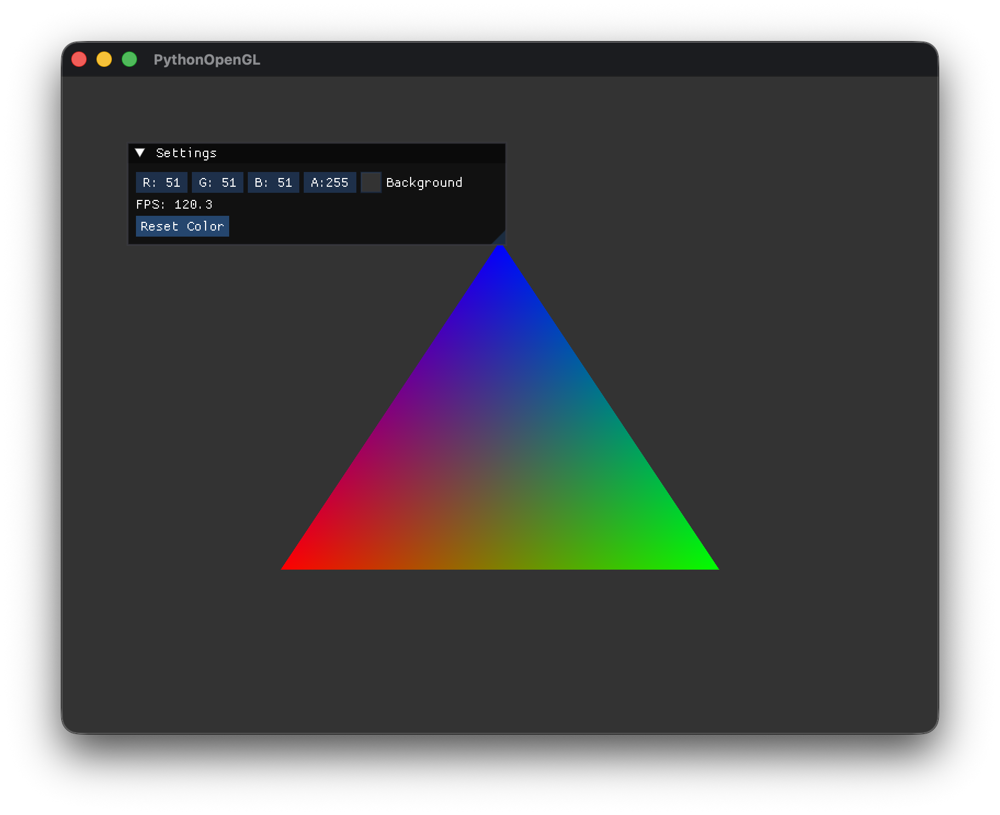

# GitHub Copilotと作る Pythonで OpenGL 3Dプログラミング

## 第4回「シェーダー入門 - 虹色の三角形を描く」

[:contents]

### はじめに

前回は、imguiを組み込んでデバッグUIを追加しました。

今回は、いよいよ**シェーダー**を学び、**虹色の三角形**を描画します。シェーダーはGPU上で動作するプログラムで、現代のOpenGLでは必須の技術です。

### コード構成のリファクタリング

シェーダーの説明に入る前に、今回からコードの見通しを良くするためリファクタリングを行いました。

**変更点：**
- `src/main.py` の肥大化を防ぐため、`App`/`Window`/`GUI` クラスに分割
- `src/utils/logger.py` にカスタムロガーを導入（色付き出力、独自レベル対応）
- OpenGLのインポートを `import OpenGL.GL as gl` 形式に統一

機能的には前回と変わりませんので、各クラスの詳細説明は割愛します。リファクタリング後のディレクトリ構成は記事末尾をご覧ください。

### シェーダーとは

**シェーダー（Shader）** は、GPU上で実行される小さなプログラムです。OpenGLのグラフィックスパイプラインにおいて、頂点の処理やピクセルの色計算を担当します。

主なシェーダーの種類：

| シェーダー | 役割 |
|-----------|------|
| **頂点シェーダー** | 各頂点の位置と属性を処理 |
| **フラグメントシェーダー** | 各ピクセルの最終的な色を決定 |
| ジオメトリシェーダー | 頂点から新しいジオメトリを生成（オプション） |
| テッセレーションシェーダー | 曲面の細分化（オプション） |

今回は必須の**頂点シェーダー**と**フラグメントシェーダー**を使います。

### グラフィックスパイプライン

シェーダーがどこで動作するか理解するため、グラフィックスパイプラインを見てみましょう：

```
頂点データ → [頂点シェーダー] → プリミティブ組立 → ラスタライズ → [フラグメントシェーダー] → 画面表示
```

1. **頂点データ**: 三角形の3頂点の座標と色
2. **頂点シェーダー**: 各頂点の座標変換（今回は変換なし）
3. **プリミティブ組立**: 頂点を三角形として組み立て
4. **ラスタライズ**: 三角形内部のピクセルを決定
5. **フラグメントシェーダー**: 各ピクセルの色を計算（頂点間で補間）
6. **画面表示**: 最終的なピクセルをフレームバッファに書き込み

### GLSL（シェーダー言語）

シェーダーは**GLSL（OpenGL Shading Language）** で記述します。C言語に似た文法で、ベクトルや行列の操作が組み込まれています。

基本的なデータ型：

| 型 | 説明 | 例 |
|----|------|-----|
| `float` | 浮動小数点 | `1.0` |
| `vec2` | 2次元ベクトル | `vec2(1.0, 2.0)` |
| `vec3` | 3次元ベクトル | `vec3(1.0, 0.0, 0.0)` |
| `vec4` | 4次元ベクトル | `vec4(1.0, 1.0, 1.0, 1.0)` |
| `mat4` | 4x4行列 | 座標変換に使用 |

### 頂点シェーダー

頂点シェーダーは各頂点に対して実行されます。頂点の位置を変換し、フラグメントシェーダーに渡すデータを準備します。

`src/shaders/basic.vert`:

```glsl
#version 330 core

// 頂点属性（入力）
layout (location = 0) in vec3 aPos;      // 頂点座標
layout (location = 1) in vec3 aColor;    // 頂点カラー

// フラグメントシェーダーへの出力
out vec3 vertexColor;

void main()
{
    // 頂点座標をクリップ座標に変換
    // 今回は変換なし（NDC座標をそのまま使用）
    gl_Position = vec4(aPos, 1.0);

    // 頂点カラーをフラグメントシェーダーに渡す
    vertexColor = aColor;
}
```

**ポイント：**

- `#version 330 core`: OpenGL 3.3 Core Profileを使用
- `layout (location = 0)`: 頂点属性のインデックス（後で`glVertexAttribPointer`で指定）
- `in`: 入力変数（頂点データから受け取る）
- `out`: 出力変数（フラグメントシェーダーに渡す）
- `gl_Position`: 組み込み出力変数（頂点の最終位置）

### フラグメントシェーダー

フラグメントシェーダーは各ピクセルに対して実行されます。頂点シェーダーからの出力を受け取り、最終的な色を決定します。

`src/shaders/basic.frag`:

```glsl
#version 330 core

// 頂点シェーダーからの入力
in vec3 vertexColor;

// 最終的なピクセルカラー（出力）
out vec4 FragColor;

void main()
{
    // 頂点カラーをそのまま出力（アルファは1.0で不透明）
    FragColor = vec4(vertexColor, 1.0);
}
```

**ポイント：**

- `in vec3 vertexColor`: 頂点シェーダーから補間された色を受け取る
- `out vec4 FragColor`: 最終的なピクセル色（RGBA）

重要なのは、`vertexColor`が**自動的に補間される**ことです。三角形の各頂点に異なる色を設定すると、内部のピクセルはグラデーションになります。

### NDC座標系

今回は座標変換なしで描画するため、**NDC（Normalized Device Coordinates）** を使用します。

NDC座標系では：
- X軸: -1.0（左端）〜 1.0（右端）
- Y軸: -1.0（下端）〜 1.0（上端）
- Z軸: -1.0（手前）〜 1.0（奥）

```
      (0, 1)
        ↑
        │
(-1, 0) ┼───→ (1, 0)
        │
        ↓
      (0, -1)
```

### Shaderクラス

シェーダーの管理を行うクラスを作成します。

`src/graphics/shader.py`:

```python
"""
シェーダー管理クラス
"""
from pathlib import Path
import OpenGL.GL as gl

from src.utils import logger


class ShaderCompileError(Exception):
    """シェーダーのコンパイルエラー"""
    pass


class ShaderLinkError(Exception):
    """シェーダープログラムのリンクエラー"""
    pass


class Shader:
    """シェーダープログラムを管理するクラス"""

    def __init__(self, vertex_path: str | Path, fragment_path: str | Path) -> None:
        """
        シェーダーファイルを読み込み、プログラムを作成する

        Args:
            vertex_path: 頂点シェーダーファイルのパス
            fragment_path: フラグメントシェーダーファイルのパス
        """
        self._program_id: int = 0

        # シェーダーソースの読み込み
        vertex_source = self._load_shader_source(vertex_path)
        fragment_source = self._load_shader_source(fragment_path)

        # シェーダーのコンパイル
        vertex_shader = self._compile_shader(vertex_source, gl.GL_VERTEX_SHADER, "vertex")
        fragment_shader = self._compile_shader(fragment_source, gl.GL_FRAGMENT_SHADER, "fragment")

        # シェーダープログラムのリンク
        self._program_id = self._link_program(vertex_shader, fragment_shader)

        # コンパイル済みシェーダーの削除（プログラムにリンク済みなので不要）
        gl.glDeleteShader(vertex_shader)
        gl.glDeleteShader(fragment_shader)

        logger.info(f"Shader program created: {Path(vertex_path).name}, {Path(fragment_path).name}")

    def _load_shader_source(self, path: str | Path) -> str:
        """シェーダーファイルを読み込む"""
        path = Path(path)
        if not path.exists():
            raise FileNotFoundError(f"Shader file not found: {path}")

        with open(path, 'r', encoding='utf-8') as f:
            return f.read()

    def _compile_shader(self, source: str, shader_type: int, type_name: str) -> int:
        """シェーダーをコンパイルする"""
        shader = gl.glCreateShader(shader_type)
        gl.glShaderSource(shader, source)
        gl.glCompileShader(shader)

        # コンパイル結果の確認
        success = gl.glGetShaderiv(shader, gl.GL_COMPILE_STATUS)
        if success != gl.GL_TRUE:
            info_log = gl.glGetShaderInfoLog(shader).decode('utf-8')
            gl.glDeleteShader(shader)
            raise ShaderCompileError(f"{type_name} shader compile error:\n{info_log}")

        return shader

    def _link_program(self, vertex_shader: int, fragment_shader: int) -> int:
        """シェーダープログラムをリンクする"""
        program = gl.glCreateProgram()
        gl.glAttachShader(program, vertex_shader)
        gl.glAttachShader(program, fragment_shader)
        gl.glLinkProgram(program)

        # リンク結果の確認
        success = gl.glGetProgramiv(program, gl.GL_LINK_STATUS)
        if success != gl.GL_TRUE:
            info_log = gl.glGetProgramInfoLog(program).decode('utf-8')
            gl.glDeleteProgram(program)
            raise ShaderLinkError(f"Shader program link error:\n{info_log}")

        return program

    def use(self) -> None:
        """このシェーダープログラムを使用する"""
        gl.glUseProgram(self._program_id)

    def delete(self) -> None:
        """シェーダープログラムを削除する"""
        if self._program_id:
            gl.glDeleteProgram(self._program_id)
            self._program_id = 0
```

### VBO/VAOの基礎

頂点データをGPUに送るには、**VBO（Vertex Buffer Object）** と**VAO（Vertex Array Object）** を使います。

- **VBO**: 頂点データを格納するバッファ
- **VAO**: 頂点属性の設定を記憶するオブジェクト

```python
def _setup_geometry(self) -> None:
    """三角形のジオメトリをセットアップする"""
    # 頂点データ（位置 x, y, z, 色 r, g, b）
    vertices = np.array([
        # 位置              # 色
        -0.5, -0.5, 0.0,   1.0, 0.0, 0.0,  # 左下: 赤
         0.5, -0.5, 0.0,   0.0, 1.0, 0.0,  # 右下: 緑
         0.0,  0.5, 0.0,   0.0, 0.0, 1.0,  # 上: 青
    ], dtype=np.float32)

    # VAO（頂点配列オブジェクト）の作成
    self._vao = gl.glGenVertexArrays(1)
    gl.glBindVertexArray(self._vao)

    # VBO（頂点バッファオブジェクト）の作成
    self._vbo = gl.glGenBuffers(1)
    gl.glBindBuffer(gl.GL_ARRAY_BUFFER, self._vbo)
    gl.glBufferData(gl.GL_ARRAY_BUFFER, vertices.nbytes, vertices, gl.GL_STATIC_DRAW)

    # 頂点属性の設定
    stride = 6 * vertices.itemsize  # 1頂点あたり6つのfloat

    # 属性0: 位置（location = 0）
    gl.glVertexAttribPointer(0, 3, gl.GL_FLOAT, gl.GL_FALSE, stride, None)
    gl.glEnableVertexAttribArray(0)

    # 属性1: 色（location = 1）
    offset = 3 * vertices.itemsize
    gl.glVertexAttribPointer(1, 3, gl.GL_FLOAT, gl.GL_FALSE, stride, ctypes.c_void_p(offset))
    gl.glEnableVertexAttribArray(1)

    # バインド解除
    gl.glBindBuffer(gl.GL_ARRAY_BUFFER, 0)
    gl.glBindVertexArray(0)
```

**頂点データの構造：**

```
頂点0: [x, y, z, r, g, b]  ← 6つのfloat
頂点1: [x, y, z, r, g, b]
頂点2: [x, y, z, r, g, b]
```

`stride`は次の頂点までのバイト数、`offset`は属性データの開始位置です。

### 三角形の描画

描画は非常にシンプルです：

```python
def _draw_triangle(self) -> None:
    """三角形を描画する"""
    self._shader.use()              # シェーダーをアクティブに
    gl.glBindVertexArray(self._vao) # VAOをバインド
    gl.glDrawArrays(gl.GL_TRIANGLES, 0, 3)  # 3頂点の三角形を描画
    gl.glBindVertexArray(0)         # VAOのバインド解除
```

### ディレクトリ構成

Phase 4で以下のファイルを追加しました：

```
src/
├── main.py
├── core/
│   ├── __init__.py
│   ├── app.py          # シェーダー・ジオメトリ追加
│   ├── gui.py
│   └── window.py
├── graphics/
│   ├── __init__.py     # 新規
│   └── shader.py       # 新規: Shaderクラス
├── shaders/
│   ├── basic.vert      # 新規: 頂点シェーダー
│   └── basic.frag      # 新規: フラグメントシェーダー
└── utils/
    ├── __init__.py
    └── logger.py
```

### 動作確認

コードを実行してみましょう：

```bash
# 仮想環境を有効化
source .venv/bin/activate  # macOS/Linux

# 実行
python -m src.main
```

虹色にグラデーションした三角形が表示されます！



各頂点に赤・緑・青を設定したため、フラグメントシェーダーで補間され、美しいグラデーションになっています。

### よくあるエラーと対処法

#### シェーダーコンパイルエラー

```
ShaderCompileError: vertex shader compile error:
0:1(1): error: syntax error, unexpected ...
```

→ GLSL文法エラー。行番号を確認してシェーダーファイルを修正。

#### シェーダーリンクエラー

```
ShaderLinkError: Shader program link error:
error: undefined variable ...
```

→ 頂点シェーダーの`out`とフラグメントシェーダーの`in`の変数名が一致しているか確認。

#### 三角形が表示されない

1. **座標が範囲外**: NDC座標は-1.0〜1.0。範囲外だと見えない。
2. **シェーダーが使用されていない**: `shader.use()`を呼んでいるか確認。
3. **VAOがバインドされていない**: `glBindVertexArray(vao)`を確認。

### まとめ

今回は、シェーダーを使って虹色の三角形を描画しました。

学んだこと：
- **シェーダー**: GPU上で動作するプログラム
- **頂点シェーダー**: 頂点の位置と属性を処理
- **フラグメントシェーダー**: ピクセルの色を決定
- **GLSL**: シェーダー言語の基礎
- **VBO/VAO**: 頂点データのGPU転送と管理
- **頂点属性**: 位置と色のデータレイアウト

シェーダーはOpenGLの核心です。今後のフェーズで座標変換、ライティング、テクスチャなど、より高度なシェーダー技術を学んでいきます。

次回は、座標変換の基礎を学び、3D空間での描画に挑戦します。

---

**前回**: [第3回「imguiを組み込む」](https://an-embedded-engineer.hateblo.jp/entry/2025/11/30/003141)

**次回**: [第5回「座標変換の基礎」](https://an-embedded-engineer.hateblo.jp/entry/2025/11/30/042100)
