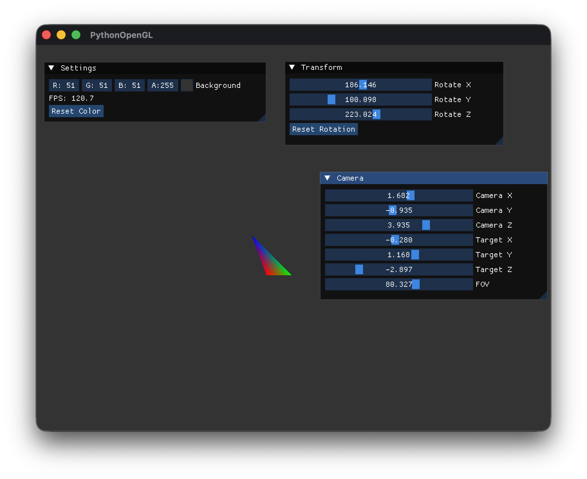

# GitHub Copilotと作る Pythonで OpenGL 3Dプログラミング

## 第5回「座標変換の基礎」

[:contents]

### はじめに

前回は、シェーダーを学び、虹色の三角形を描画しました。

今回は、**座標変換**の基礎を学びます。Model、View、Projection行列を使って、3D空間でオブジェクトを配置し、カメラから見た映像を画面に表示する仕組みを実装します。

### 座標系の理解

OpenGLでは、頂点が画面に表示されるまでに複数の座標系を経由します。

```
ローカル座標 → ワールド座標 → ビュー座標 → クリップ座標 → スクリーン座標
           Model行列    View行列    Projection行列
```

| 座標系 | 説明 |
|--------|------|
| **ローカル座標** | モデル固有の座標系（モデルの中心が原点） |
| **ワールド座標** | シーン全体の共通座標系 |
| **ビュー座標** | カメラを原点とした座標系 |
| **クリップ座標** | 正規化デバイス座標（-1〜1の範囲） |
| **スクリーン座標** | 最終的なピクセル座標 |

これらの変換は、3つの行列を掛け合わせることで実現します：

```
gl_Position = Projection × View × Model × 頂点座標
```

**注意**: 行列の乗算は右から左へ適用されます。

### Model行列

**Model行列**は、オブジェクトをローカル座標からワールド座標に変換します。以下の3つの基本変換を組み合わせます：

| 変換 | 説明 |
|------|------|
| **平行移動** (Translation) | オブジェクトを移動 |
| **回転** (Rotation) | オブジェクトを回転 |
| **スケーリング** (Scaling) | オブジェクトの大きさを変更 |

例えば、Y軸周りに45度回転する行列は：

```python
angle_rad = np.radians(45.0)
cos_a, sin_a = np.cos(angle_rad), np.sin(angle_rad)
rotation_y = np.array([
    [cos_a, 0, sin_a, 0],
    [0, 1, 0, 0],
    [-sin_a, 0, cos_a, 0],
    [0, 0, 0, 1]
], dtype=np.float32)
```

### View行列（Look At行列）

**View行列**は、ワールド座標をカメラ座標に変換します。カメラの位置と向きを定義する3つのパラメータで構成されます：

| パラメータ | 説明 |
|-----------|------|
| **eye** | カメラの位置 |
| **target** | カメラが見ている点 |
| **up** | カメラの上方向ベクトル |

Look At行列の計算：

```python
def _look_at(self, eye: np.ndarray, target: np.ndarray, up: np.ndarray) -> np.ndarray:
    # 前方向ベクトル（正規化）
    forward = target - eye
    forward = forward / np.linalg.norm(forward)

    # 右ベクトル
    right = np.cross(forward, up)
    right = right / np.linalg.norm(right)

    # 新しい上ベクトル
    up_new = np.cross(right, forward)

    # View行列を構築
    view = np.eye(4, dtype=np.float32)
    view[0, 0:3] = right
    view[1, 0:3] = up_new
    view[2, 0:3] = -forward
    view[0, 3] = -np.dot(right, eye)
    view[1, 3] = -np.dot(up_new, eye)
    view[2, 3] = np.dot(forward, eye)

    return view
```

### Projection行列（透視投影）

**Projection行列**は、3D空間を2D画面に投影します。透視投影を使うと、遠くのものが小さく見えるリアルな描画ができます。

| パラメータ | 説明 | 今回の値 |
|-----------|------|---------|
| **FOV** | 視野角（度数法） | 45.0 |
| **aspect** | アスペクト比（幅/高さ） | 800/600 |
| **near** | ニアクリップ面 | 0.1 |
| **far** | ファークリップ面 | 100.0 |

```python
@staticmethod
def _perspective(fov_deg: float, aspect: float, near: float, far: float) -> np.ndarray:
    fov_rad = np.radians(fov_deg)
    f = 1.0 / np.tan(fov_rad / 2.0)

    projection = np.zeros((4, 4), dtype=np.float32)
    projection[0, 0] = f / aspect
    projection[1, 1] = f
    projection[2, 2] = (far + near) / (near - far)
    projection[2, 3] = (2 * far * near) / (near - far)
    projection[3, 2] = -1.0

    return projection
```

### Transformクラス

座標変換を管理する`Transform`クラスを作成しました。

`src/graphics/transform.py`:

```python
class Transform:
    """3D座標変換を管理するクラス"""

    def __init__(self) -> None:
        # Model行列
        self._model = np.eye(4, dtype=np.float32)

        # View行列（カメラ）
        self._camera_pos = np.array([0.0, 0.0, 3.0], dtype=np.float32)
        self._camera_target = np.array([0.0, 0.0, 0.0], dtype=np.float32)
        self._camera_up = np.array([0.0, 1.0, 0.0], dtype=np.float32)
        self._view = self._look_at(self._camera_pos, self._camera_target, self._camera_up)

        # Projection行列
        self._fov = 45.0
        self._aspect = 800.0 / 600.0
        self._near = 0.1
        self._far = 100.0
        self._projection = self._perspective(self._fov, self._aspect, self._near, self._far)
```

Model行列の操作メソッド：

```python
def set_model_identity(self) -> None:
    """Model行列を単位行列にリセット"""
    self._model = np.eye(4, dtype=np.float32)

def rotate_model_x(self, angle_deg: float) -> None:
    """Model行列にX軸回転を適用"""
    # 回転行列を計算してself._modelに適用

def rotate_model_y(self, angle_deg: float) -> None:
    """Model行列にY軸回転を適用"""

def rotate_model_z(self, angle_deg: float) -> None:
    """Model行列にZ軸回転を適用"""
```

### シェーダーの更新

頂点シェーダーにUniform行列を追加しました。

`src/shaders/basic.vert`:

```glsl
#version 330 core

layout (location = 0) in vec3 aPos;
layout (location = 1) in vec3 aColor;

// Uniform変数（行列）
uniform mat4 model;
uniform mat4 view;
uniform mat4 projection;

out vec3 vertexColor;

void main()
{
    // 座標変換を適用
    gl_Position = projection * view * model * vec4(aPos, 1.0);
    vertexColor = aColor;
}
```

### 行列をシェーダーに渡す

行列をシェーダーに渡す際の重要なポイントがあります。numpyは**行優先**（row-major）でデータを格納しますが、OpenGLは**列優先**（column-major）を期待します。

`Shader.set_mat4`メソッドでは、`GL_TRUE`を指定して転置を行います：

```python
def set_mat4(self, name: str, matrix) -> None:
    """4x4行列のUniform変数を設定"""
    location = self._get_uniform_location(name)
    if location != -1:
        # GL_TRUE: numpyの行優先配列をOpenGLの列優先形式に転置
        gl.glUniformMatrix4fv(location, 1, gl.GL_TRUE, matrix)
```

描画時に行列を設定：

```python
def _draw_triangle(self) -> None:
    # Model行列を更新
    self._transform.set_model_identity()
    self._transform.rotate_model_x(self._rotation_x)
    self._transform.rotate_model_y(self._rotation_y)
    self._transform.rotate_model_z(self._rotation_z)

    # シェーダーを使用
    self._shader.use()

    # 行列をシェーダーに設定
    self._shader.set_mat4("model", self._transform.model)
    self._shader.set_mat4("view", self._transform.view)
    self._shader.set_mat4("projection", self._transform.projection)

    # 描画
    gl.glBindVertexArray(self._vao)
    gl.glDrawArrays(gl.GL_TRIANGLES, 0, 3)
    gl.glBindVertexArray(0)
```

### imguiでパラメータ調整

カメラと回転のパラメータをimguiで調整できるようにしました。

**Cameraウィンドウ：**

```python
def _draw_camera_window(self) -> None:
    imgui.begin("Camera")

    # カメラ位置
    cam_pos = self._transform.camera_pos
    changed_x, cam_x = imgui.slider_float("Camera X##pos", cam_pos[0], -10.0, 10.0)
    changed_y, cam_y = imgui.slider_float("Camera Y##pos", cam_pos[1], -10.0, 10.0)
    changed_z, cam_z = imgui.slider_float("Camera Z##pos", cam_pos[2], -10.0, 10.0)

    if changed_x or changed_y or changed_z:
        self._transform.set_camera_position(cam_x, cam_y, cam_z)

    # 視野角
    changed_fov, fov = imgui.slider_float("FOV", self._transform.fov, 15.0, 120.0)
    if changed_fov:
        self._transform.set_fov(fov)

    imgui.end()
```

**Transformウィンドウ：**

```python
def _draw_transform_window(self) -> None:
    imgui.begin("Transform")

    # Model行列の回転
    changed_x, self._rotation_x = imgui.slider_float("Rotate X", self._rotation_x, 0.0, 360.0)
    changed_y, self._rotation_y = imgui.slider_float("Rotate Y", self._rotation_y, 0.0, 360.0)
    changed_z, self._rotation_z = imgui.slider_float("Rotate Z", self._rotation_z, 0.0, 360.0)

    if imgui.button("Reset Rotation"):
        self._rotation_x = 0.0
        self._rotation_y = 0.0
        self._rotation_z = 0.0

    imgui.end()
```

### ディレクトリ構成

Phase 5で追加・変更したファイル：

```
src/
├── main.py
├── core/
│   ├── __init__.py
│   ├── app.py          # 変更: Transform統合、Camera/Transform UI追加
│   ├── gui.py
│   └── window.py
├── graphics/
│   ├── __init__.py     # 変更: Transform追加
│   ├── shader.py       # 変更: set_mat4の転置フラグ修正
│   └── transform.py    # 新規: Transformクラス
├── shaders/
│   ├── basic.vert      # 変更: Uniform行列追加
│   └── basic.frag
└── utils/
    ├── __init__.py
    └── logger.py
```

### 動作確認

コードを実行してみましょう：

```bash
source .venv/bin/activate && python -m src.main
```

三角形が表示され、imguiのスライダーで回転やカメラ位置を調整できます！



- **Camera X/Y/Z**: カメラ位置を移動
- **Target X/Y/Z**: カメラの注視点を変更
- **FOV**: 視野角を広げたり狭めたり
- **Rotate X/Y/Z**: 三角形を回転

### よくあるエラーと対処法

#### 三角形が表示されない

1. **行列の転置忘れ**: `glUniformMatrix4fv`の第3引数が`GL_TRUE`になっているか確認
2. **カメラ位置が近すぎる/遠すぎる**: Camera Zを調整（デフォルト3.0）
3. **Uniform変数名の不一致**: シェーダー内の変数名と`set_mat4`の引数が一致しているか確認

#### 描画がおかしい

1. **行列の乗算順序**: `projection * view * model`の順序を確認
2. **near/farクリップ面**: オブジェクトがクリップ面の範囲外にないか確認

### まとめ

今回は、座標変換の基礎を学びました。

学んだこと：
- **座標系の流れ**: ローカル → ワールド → ビュー → クリップ → スクリーン
- **Model行列**: オブジェクトの位置・回転・スケールを制御
- **View行列**: カメラの位置と向きを定義（Look At行列）
- **Projection行列**: 3Dから2Dへの透視投影
- **行列の転置**: numpyとOpenGLのメモリレイアウトの違い
- **imguiでのリアルタイム調整**: パラメータをインタラクティブに変更

次回は、2D/3Dカメラの切り替え機能を実装します。

---

**前回**: [第4回「シェーダー入門 - 虹色の三角形を描く」](https://an-embedded-engineer.hateblo.jp/entry/2025/11/30/010652)

**次回**: 第6回「2D/3Dカメラの実装」（準備中）

