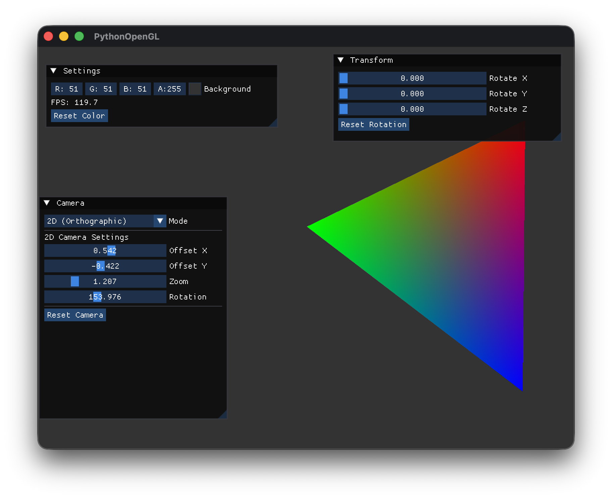
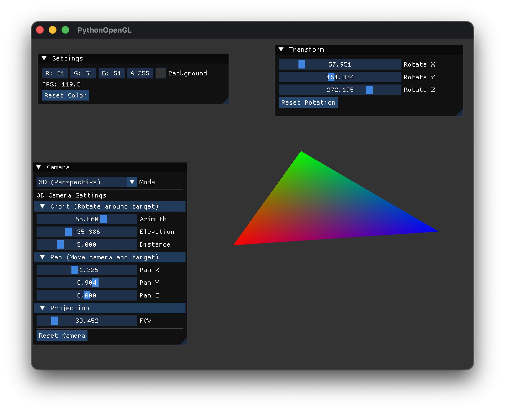

# GitHub Copilotと作る Pythonで OpenGL 3Dプログラミング

## 第6回「2D/3Dカメラの実装」

[:contents]

### はじめに

前回は座標変換の基礎として、Model・View・Projection行列について学びました。今回は**2D/3Dカメラ**を実装し、それぞれのカメラクラスを作成します。

2Dゲームや3Dアプリケーションでは、それぞれ異なる投影方式が必要です。2Dでは**正射影（Orthographic Projection）**、3Dでは**透視投影（Perspective Projection）**を使用します。

### 今回のゴール

- **Camera2D / Camera3D クラス**を作成し、用途に応じて使い分け
- **正射影**（2Dカメラ）の実装
- **透視投影**（3Dカメラ）の実装
- 3Dカメラの**オービット**（球面座標）と**パン**（平行移動）操作
- imguiでカメラモードとパラメータを調整

### 正射影と透視投影の違い

#### 正射影（Orthographic Projection）

正射影は、距離に関係なく**同じサイズで表示**される投影方式です。

```
  ┌─────────┐
  │         │
  │    ●    │ ← どの距離でも同じサイズ
  │         │
  └─────────┘
```

特徴：
- 遠近感がない
- 2Dゲーム、UI、設計図などに適している
- **ズーム倍率**で表示範囲を制御

#### 透視投影（Perspective Projection）

前回実装した透視投影は、人間の目やカメラのように**遠くのものほど小さく**見える投影方式です。

```
     視点
      ╲│╱
       ●
      ╱│╲
     / │ \
    /  │  \
   /   │   \
  ╱────┼────╲  ← 遠くのクリップ面
```

特徴：
- 遠近感がある
- 3Dシーンに適している
- **FOV（視野角）** でズームを制御


### カメラクラスの設計

今回は**基底クラス + 派生クラス**の構成でカメラを実装します。

```
CameraBase (抽象基底クラス)
├── Camera2D (正射影カメラ)
└── Camera3D (透視投影カメラ)
```

この設計により：
- 2Dと3Dで異なるパラメータを明確に分離
- 共通インターフェース（`view_matrix`, `projection_matrix`）を提供
- 教育的にわかりやすい構造

### CameraBaseクラス（基底クラス）

`src/graphics/camera.py`を作成します。

```python
"""
カメラモジュール

2D/3Dカメラの基底クラスと派生クラスを提供
"""
from abc import ABC, abstractmethod
from enum import Enum
from typing import Tuple, Union

import numpy as np

from src.utils.logger import logger


class CameraMode(Enum):
    """カメラモード"""
    CAMERA_2D = 0  # 正射影（2D）
    CAMERA_3D = 1  # 透視投影（3D）


class CameraBase(ABC):
    """
    カメラの基底クラス

    View行列とProjection行列を提供する抽象クラス
    """

    def __init__(self, width: int = 800, height: int = 600) -> None:
        self._width = width
        self._height = height
        self._aspect = width / height if height > 0 else 1.0

        # 行列のキャッシュ
        self._view_matrix = np.eye(4, dtype=np.float32)
        self._projection_matrix = np.eye(4, dtype=np.float32)

    @property
    @abstractmethod
    def mode(self) -> CameraMode:
        """カメラモードを取得"""
        pass

    @property
    def view_matrix(self) -> np.ndarray:
        """View行列を取得"""
        return self._view_matrix

    @property
    def projection_matrix(self) -> np.ndarray:
        """Projection行列を取得"""
        return self._projection_matrix

    @abstractmethod
    def reset(self) -> None:
        """カメラをデフォルト状態にリセット"""
        pass
```

### Camera2Dクラス（正射影カメラ）

2Dカメラはシンプルな平行移動、ズーム、回転を提供します。

```python
class Camera2D(CameraBase):
    """
    2Dカメラクラス

    正射影（Orthographic Projection）を使用
    """

    def __init__(self, width: int = 800, height: int = 600) -> None:
        super().__init__(width, height)

        # カメラ位置（XY平面上のオフセット）
        self._position_x = 0.0
        self._position_y = 0.0

        # ズーム倍率
        self._zoom = 1.0

        # 回転角度（度）
        self._rotation = 0.0

        # クリップ面
        self._near = -10.0
        self._far = 10.0

        self._update_view_matrix()
        self._update_projection_matrix()
        logger.info("Camera2D initialized")

    @property
    def mode(self) -> CameraMode:
        return CameraMode.CAMERA_2D

    @property
    def position(self) -> Tuple[float, float]:
        """カメラ位置を取得（2D: XY座標）"""
        return (self._position_x, self._position_y)

    def set_position(self, x: float, y: float) -> None:
        """カメラ位置を設定"""
        self._position_x = x
        self._position_y = y
        self._update_view_matrix()

    @property
    def zoom(self) -> float:
        return self._zoom

    def set_zoom(self, zoom: float) -> None:
        self._zoom = max(0.01, zoom)
        self._update_projection_matrix()

    @property
    def rotation(self) -> float:
        """回転角度を取得(度)"""
        return self._rotation

    def set_rotation(self, rotation: float) -> None:
        """回転角度を設定(度)"""
        self._rotation = rotation % 360.0
        self._update_view_matrix()
```

#### 2D用View行列

2Dモードでは、回転と平行移動を組み合わせたView行列を使用します。

```python
    def _update_view_matrix(self) -> None:
        """View行列を更新"""
        # 回転行列を計算
        angle_rad = np.radians(self._rotation)
        cos_a = np.cos(angle_rad)
        sin_a = np.sin(angle_rad)

        # View行列 = 回転 * 平行移動
        self._view_matrix = np.eye(4, dtype=np.float32)
        # 回転部分
        self._view_matrix[0, 0] = cos_a
        self._view_matrix[0, 1] = sin_a
        self._view_matrix[1, 0] = -sin_a
        self._view_matrix[1, 1] = cos_a
        # 平行移動部分（回転後の座標系で適用）
        self._view_matrix[0, 3] = -(cos_a * self._position_x + sin_a * self._position_y)
        self._view_matrix[1, 3] = -(-sin_a * self._position_x + cos_a * self._position_y)
```

回転と平行移動を組み合わせることで、カメラを回転させても正しくオフセットが適用されます。

#### 正射影行列の計算

```python
    def _update_projection_matrix(self) -> None:
        """Projection行列を更新（正射影）"""
        # ズームを適用した表示範囲
        half_width = self._aspect / self._zoom
        half_height = 1.0 / self._zoom

        left = -half_width
        right = half_width
        bottom = -half_height
        top = half_height

        # 正射影行列
        self._projection_matrix = np.zeros((4, 4), dtype=np.float32)
        self._projection_matrix[0, 0] = 2.0 / (right - left)
        self._projection_matrix[1, 1] = 2.0 / (top - bottom)
        self._projection_matrix[2, 2] = -2.0 / (self._far - self._near)
        self._projection_matrix[0, 3] = -(right + left) / (right - left)
        self._projection_matrix[1, 3] = -(top + bottom) / (top - bottom)
        self._projection_matrix[2, 3] = -(self._far + self._near) / (self._far - self._near)
        self._projection_matrix[3, 3] = 1.0
```

正射影行列の各要素：
- `[0,0]` と `[1,1]`: 表示範囲を正規化（-1〜1）
- `[2,2]`: Z方向の正規化
- `[0,3]`, `[1,3]`, `[2,3]`: 中心へのオフセット

### Camera3Dクラス（透視投影カメラ）

3Dカメラは**オービット**（球面座標）と**パン**（平行移動）の2つの操作方法を提供します。

```python
class Camera3D(CameraBase):
    """
    3Dカメラクラス

    透視投影（Perspective Projection）を使用
    """

    def __init__(self, width: int = 800, height: int = 600) -> None:
        super().__init__(width, height)

        # カメラ位置
        self._position = np.array([0.0, 0.0, 5.0], dtype=np.float32)
        # カメラの視点（見る点）
        self._target = np.array([0.0, 0.0, 0.0], dtype=np.float32)
        # 上ベクトル
        self._up = np.array([0.0, 1.0, 0.0], dtype=np.float32)

        # 透視投影パラメータ
        self._fov = 45.0  # 視野角（度）
        self._near = 0.1
        self._far = 100.0

        self._update_view_matrix()
        self._update_projection_matrix()
        logger.info("Camera3D initialized")
```

#### オービット操作（球面座標）

オービットは、視点（target）を中心として球面上にカメラを配置する操作です。マウスドラッグでの回転操作のベースになります。

```
        ↑ Y (elevation)
        │
        │  ● カメラ
        │ /
        │/  distance
        ●────→ X (azimuth)
       target
```

```python
    def set_orbit(self, azimuth: float, elevation: float, distance: float) -> None:
        """
        オービット（球面座標）でカメラ位置を設定

        Args:
            azimuth: 方位角（水平回転、度）0=正面、90=右、-90=左
            elevation: 仰角（垂直回転、度）0=水平、90=真上、-90=真下
            distance: 視点からの距離
        """
        azimuth_rad = np.radians(azimuth)
        elevation_rad = np.radians(elevation)

        # 球面座標からカメラ位置を計算
        x = distance * np.cos(elevation_rad) * np.sin(azimuth_rad)
        y = distance * np.sin(elevation_rad)
        z = distance * np.cos(elevation_rad) * np.cos(azimuth_rad)

        self._position = self._target + np.array([x, y, z], dtype=np.float32)
        self._update_view_matrix()

    def get_orbit(self) -> Tuple[float, float, float]:
        """現在のオービットパラメータを取得"""
        rel = self._position - self._target
        distance = float(np.linalg.norm(rel))

        if distance < 0.001:
            return (0.0, 0.0, distance)

        rel_norm = rel / distance
        elevation = np.degrees(np.arcsin(np.clip(rel_norm[1], -1.0, 1.0)))
        azimuth = np.degrees(np.arctan2(rel_norm[0], rel_norm[2]))

        return (float(azimuth), float(elevation), distance)
```

#### パン操作（平行移動）

パンは、カメラと視点を同時に移動させる操作です。2Dカメラのオフセットと同様の動きになります。

```python
    def set_pan(self, x: float, y: float, z: float) -> None:
        """
        カメラのパン位置を設定

        カメラ位置と視点の両方にオフセットを適用
        """
        default_pos = np.array([0.0, 0.0, 5.0], dtype=np.float32)
        default_target = np.array([0.0, 0.0, 0.0], dtype=np.float32)
        offset = np.array([x, y, z], dtype=np.float32)

        self._position = default_pos + offset
        self._target = default_target + offset
        self._update_view_matrix()

    @property
    def pan(self) -> Tuple[float, float, float]:
        """現在のパンオフセットを取得"""
        return tuple(self._target)
```

#### Look At行列（View行列）

3DカメラではLook At行列を使用します。

```python
    def _update_view_matrix(self) -> None:
        """View行列を更新（Look At行列）"""
        eye = self._position
        target = self._target
        up = self._up

        # 前方向ベクトル（正規化）
        forward = target - eye
        forward = forward / np.linalg.norm(forward)

        # 右ベクトル
        right = np.cross(forward, up)
        right = right / np.linalg.norm(right)

        # 新しい上ベクトル
        up_new = np.cross(right, forward)

        # View行列を構築
        self._view_matrix = np.eye(4, dtype=np.float32)
        self._view_matrix[0, 0:3] = right
        self._view_matrix[1, 0:3] = up_new
        self._view_matrix[2, 0:3] = -forward
        self._view_matrix[0, 3] = -np.dot(right, eye)
        self._view_matrix[1, 3] = -np.dot(up_new, eye)
        self._view_matrix[2, 3] = np.dot(forward, eye)
```

### アプリケーションへの統合

`app.py`でCamera2D/Camera3Dクラスを使用するように変更します。

```python
from src.graphics import Shader, Camera2D, Camera3D, CameraMode

class App:
    def __init__(self) -> None:
        # ...

        # カメラ（2D/3D切り替え対応）
        self._camera_2d = Camera2D(800, 600)
        self._camera_3d = Camera3D(800, 600)
        self._use_3d_camera = True  # 3Dカメラを使用

        # 座標変換（Model行列用）
        self._transform = Transform()
```

#### カメラウィンドウの更新

モードに応じて異なる設定UIを表示します。

```python
    def _draw_camera_window(self) -> None:
        """Draw camera window"""
        imgui.begin("Camera")

        # Camera mode selection
        mode_names = ["2D (Orthographic)", "3D (Perspective)"]
        current_mode = 1 if self._use_3d_camera else 0
        changed_mode, new_mode = imgui.combo("Mode", current_mode, mode_names)
        if changed_mode:
            self._use_3d_camera = (new_mode == 1)

        imgui.separator()

        if not self._use_3d_camera:
            # === 2D Camera Settings ===
            imgui.text("2D Camera Settings")

            cam_pos = self._camera_2d.position
            changed_x, cam_x = imgui.slider_float("Offset X", cam_pos[0], -5.0, 5.0)
            changed_y, cam_y = imgui.slider_float("Offset Y", cam_pos[1], -5.0, 5.0)
            if changed_x or changed_y:
                self._camera_2d.set_position(cam_x, cam_y)

            changed_zoom, zoom = imgui.slider_float("Zoom", self._camera_2d.zoom, 0.1, 5.0)
            if changed_zoom:
                self._camera_2d.set_zoom(zoom)

            # Rotation
            changed_rot, rotation = imgui.slider_float("Rotation", self._camera_2d.rotation, 0.0, 360.0)
            if changed_rot:
                self._camera_2d.set_rotation(rotation)

        else:
            # === 3D Camera Settings ===
            imgui.text("3D Camera Settings")

            # Orbit (spherical coordinates around target)
            if imgui.collapsing_header("Orbit (Rotate around target)"):
                orbit = self._camera_3d.get_orbit()
                changed_az, azimuth = imgui.slider_float("Azimuth", orbit[0], -180.0, 180.0)
                changed_el, elevation = imgui.slider_float("Elevation", orbit[1], -89.0, 89.0)
                changed_dist, distance = imgui.slider_float("Distance", orbit[2], 1.0, 20.0)
                if changed_az or changed_el or changed_dist:
                    self._camera_3d.set_orbit(azimuth, elevation, distance)

            # Pan (parallel translation)
            if imgui.collapsing_header("Pan (Move camera and target)"):
                pan = self._camera_3d.pan
                changed_pan_x, pan_x = imgui.slider_float("Pan X", pan[0], -5.0, 5.0)
                changed_pan_y, pan_y = imgui.slider_float("Pan Y", pan[1], -5.0, 5.0)
                changed_pan_z, pan_z = imgui.slider_float("Pan Z", pan[2], -5.0, 5.0)
                if changed_pan_x or changed_pan_y or changed_pan_z:
                    self._camera_3d.set_pan(pan_x, pan_y, pan_z)

            # Projection settings
            if imgui.collapsing_header("Projection"):
                changed_fov, fov = imgui.slider_float("FOV", self._camera_3d.fov, 15.0, 120.0)
                if changed_fov:
                    self._camera_3d.set_fov(fov)

        # Reset button
        if imgui.button("Reset Camera"):
            if self._use_3d_camera:
                self._camera_3d.reset()
            else:
                self._camera_2d.reset()

        imgui.end()
```

#### 描画時の行列設定

```python
    def _draw_triangle(self) -> None:
        """Draw triangle"""
        # ...

        # Get current camera
        camera = self._camera_3d if self._use_3d_camera else self._camera_2d

        # Set matrices to shader
        self._shader.set_mat4("model", self._transform.model)
        self._shader.set_mat4("view", camera.view_matrix)
        self._shader.set_mat4("projection", camera.projection_matrix)
```

### 3Dカメラの操作方法

3Dカメラには2つの操作方法があります。

#### オービット（Orbit）

視点（三角形のある原点）を中心に、カメラが球面上を移動します。

| パラメータ | 説明 | 範囲 |
|-----------|------|------|
| Azimuth（方位角） | 水平回転 | -180° 〜 +180° |
| Elevation（仰角） | 垂直回転 | -89° 〜 +89° |
| Distance（距離） | 視点からの距離 | 1 〜 20 |

次回のPhase 5c「マウスでカメラ操作」で、マウスドラッグでの回転操作のベースになります。

#### パン（Pan）

カメラと視点を同時に平行移動します。2Dカメラのオフセットと同様の動きです。

| パラメータ | 説明 |
|-----------|------|
| Pan X | 左右に移動 |
| Pan Y | 上下に移動 |
| Pan Z | 前後に移動 |

### 動作確認

プログラムを実行してみましょう。

```bash
source .venv/bin/activate && python -m src.main
```

Cameraウィンドウで**Mode**を切り替えると：

- **2D (Orthographic)**: 遠近感なし、ズームで表示範囲を変更
- **3D (Perspective)**: 遠近感あり、オービットとパンで操作

3Dモードでは：
- **Orbit**セクションのAzimuthを動かすと、三角形の周りを水平に回転
- **Elevation**を動かすと、上下に回転
- **Pan**セクションで平行移動

#### 2Dモードの実行結果

2Dモードでは、Offset X/Y、Zoom、Rotationで操作できます。



#### 3Dモードの実行結果

3Dモードでは、Orbit（球面座標）、Pan（平行移動）、Projection（FOV）で操作できます。



### 2Dと3Dの使い分け

| 用途 | 推奨モード | 理由 |
|------|-----------|------|
| 2Dゲーム | 正射影 | 距離に関係なく同じサイズ |
| UI/HUD | 正射影 | ピクセル単位で配置したい |
| 3Dシーン | 透視投影 | リアルな遠近感 |
| CAD/設計図 | 正射影 | 寸法が正確 |
| アイソメトリック | 正射影 | 斜め上から見下ろすスタイル |

### クラス構成のまとめ

```
CameraBase (抽象基底クラス)
│
├── Camera2D (正射影カメラ)
│   ├── position: (x, y) - 2D座標
│   ├── zoom: ズーム倍率
│   ├── rotation: 回転角度
│   └── set_position(x, y), set_rotation(angle)
│
└── Camera3D (透視投影カメラ)
    ├── position: (x, y, z) - 3D座標
    ├── target: 視点
    ├── fov: 視野角
    ├── set_orbit(azimuth, elevation, distance) - 球面座標
    ├── set_pan(x, y, z) - 平行移動
    └── set_distance(distance) - 距離変更
```

### 2Dカメラの操作方法

| パラメータ | 説明 |
|-----------|------|
| Offset X/Y | 左右・上下に移動 |
| Zoom | ズーム倍率（拡大・縮小） |
| Rotation | 回転角度（0〜360度） |

### まとめ

今回は2D/3Dカメラを実装しました。

- **CameraBase** 抽象基底クラスで共通インターフェースを定義
- **Camera2D** は正射影で、オフセットとズームを提供
- **Camera3D** は透視投影で、オービットとパンを提供
- **オービット**は球面座標でカメラを配置（マウスドラッグ回転のベース）
- **パン**は平行移動（2Dオフセットと同様の動き）

次回は**マウスでカメラ操作**を実装します。ドラッグでオービット、右ドラッグでパン、ホイールでズームなど、インタラクティブなカメラ操作を追加していきます。

---

**前回**: [第5回「座標変換の基礎」](https://an-embedded-engineer.hateblo.jp/entry/2025/11/30/042100)

**次回**: [第7回「マウスでカメラ操作」](https://an-embedded-engineer.hateblo.jp/entry/2025/12/01/221459)
