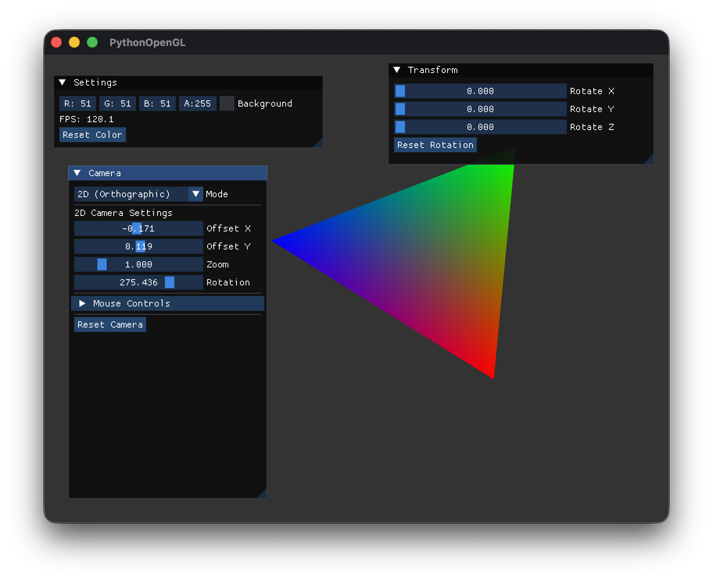
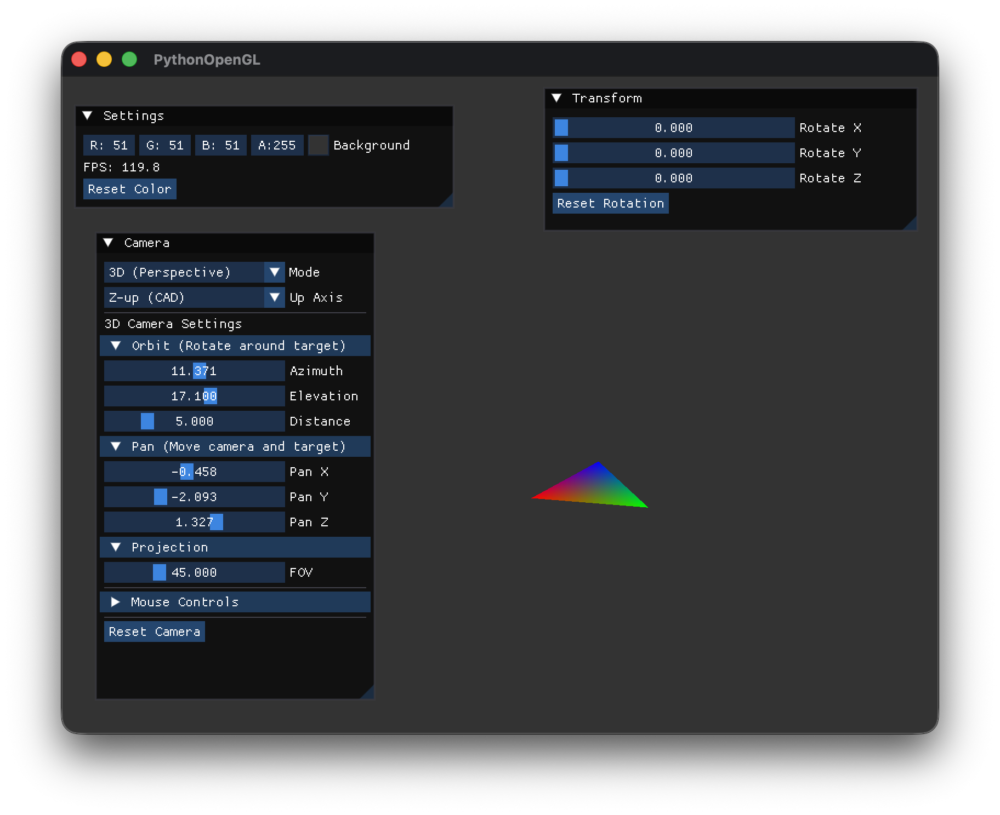

# GitHub Copilotと作る Pythonで OpenGL 3Dプログラミング

## 第7回「マウスでカメラ操作」

[:contents]

### はじめに

前回は2D/3Dカメラクラスを実装し、それぞれの投影方式を学びました。今回は**マウス操作**でカメラを直感的に操作できるようにします。

3DビューアやCADソフトでは、マウスドラッグやホイールでカメラを自由に動かせることが必須です。今回はこの機能を実装します。

### 今回のゴール

- **MouseController クラス**でマウス入力を管理
- **CameraController クラス**でマウス操作をカメラに反映
- **3Dモード**: 左ドラッグでオービット、右ドラッグでパン、中ドラッグで高さ調整、ホイールでズーム
- **2Dモード**: 左ドラッグで回転、右ドラッグでパン、ホイールでズーム
- **imgui との共存**：UIウィジェット操作とカメラ操作を両立

### マウス操作の設計

#### 操作方式の選択

3Dソフトウェアによってマウス操作の割り当ては異なります。今回は以下の方式を採用しました：

| 操作 | 3Dモード | 2Dモード |
|------|----------|----------|
| 左ドラッグ | オービット（回転） | 回転 |
| 右ドラッグ | 水平パン（XZ/XY平面） | パン |
| 中ドラッグ | 高さ調整（Y/Z軸） | パン |
| ホイール | ズーム | ズーム |

#### 座標系と水平面

3Dソフトウェアでは「上方向」の軸が異なる場合があります：

```
Y-up（OpenGL標準）       Z-up（CAD/工学系）
      Y                        Z
      |                        |
      |                        |
      +---- X                  +---- X
     /                        /
    Z                        Y

水平面: XZ平面            水平面: XY平面
高さ軸: Y軸               高さ軸: Z軸
```

- **Y-up（OpenGL標準）**: Y軸が上方向。水平面は**XZ平面**（X軸とZ軸で構成）
- **Z-up（CAD/工学系）**: Z軸が上方向。水平面は**XY平面**（X軸とY軸で構成）

今回の実装では両方の座標系に対応し、右ドラッグで**水平面上**を移動、中ドラッグで**高さ軸方向**に移動するようにしています。

#### クラス設計

マウス入力とカメラ操作を分離した設計にします：

```
MouseController
    ├── GLFWコールバック処理
    ├── ボタン状態管理
    ├── ドラッグ検出
    └── スクロール量取得

CameraController
    ├── MouseController参照
    ├── Camera2D参照
    ├── Camera3D参照
    └── マウス入力→カメラ操作変換
```

この分離により：
- マウス入力処理を再利用可能
- カメラ操作ロジックを独立してテスト可能
- 将来的にゲームパッド等の入力に対応しやすい


### MouseControllerクラス

`src/core/mouse_controller.py`を作成します。

```python
"""
マウス入力管理モジュール
"""
from enum import IntEnum
from typing import Callable, Optional, Tuple

import glfw

from src.utils.logger import logger


class MouseButton(IntEnum):
    """マウスボタン"""
    LEFT = glfw.MOUSE_BUTTON_LEFT
    RIGHT = glfw.MOUSE_BUTTON_RIGHT
    MIDDLE = glfw.MOUSE_BUTTON_MIDDLE


class MouseController:
    """
    マウス入力を管理するクラス

    GLFWからのマウスイベントを処理し、
    ドラッグ状態やスクロール量を追跡する

    Note:
        既存のコールバック（imgui等）を保持し、チェーンで呼び出す
    """

    def __init__(self, window_handle) -> None:
        """
        マウスコントローラーを初期化する

        Args:
            window_handle: GLFWウィンドウハンドル
        """
        self._window = window_handle

        # マウス位置
        self._current_x = 0.0
        self._current_y = 0.0
        self._last_x = 0.0
        self._last_y = 0.0

        # ボタン状態
        self._button_pressed = {
            MouseButton.LEFT: False,
            MouseButton.RIGHT: False,
            MouseButton.MIDDLE: False,
        }

        # ドラッグ開始位置
        self._drag_start_x = 0.0
        self._drag_start_y = 0.0

        # スクロール量（フレームごとにリセット）
        self._scroll_x = 0.0
        self._scroll_y = 0.0

        # 既存のコールバックを保存（imgui等）
        self._prev_mouse_button_callback: Optional[Callable] = None
        self._prev_cursor_pos_callback: Optional[Callable] = None
        self._prev_scroll_callback: Optional[Callable] = None

        # 既存のコールバックを取得してから、新しいコールバックを登録
        # Note: glfw.set_*_callback は前のコールバックを返す
        self._prev_mouse_button_callback = glfw.set_mouse_button_callback(
            window_handle, self._mouse_button_callback
        )
        self._prev_cursor_pos_callback = glfw.set_cursor_pos_callback(
            window_handle, self._cursor_pos_callback
        )
        self._prev_scroll_callback = glfw.set_scroll_callback(
            window_handle, self._scroll_callback
        )

        # 初期位置を取得
        x, y = glfw.get_cursor_pos(window_handle)
        self._current_x = x
        self._current_y = y
        self._last_x = x
        self._last_y = y

        logger.info("MouseController initialized")
```

#### コールバックチェーンの重要性

imguiの`GlfwRenderer`は初期化時にGLFWのマウスコールバックを登録します。`MouseController`がコールバックを上書きすると、imguiが反応しなくなってしまいます。

これを避けるため、**既存のコールバックを保存**して**チェーンで呼び出す**設計にしています：

```python
def _mouse_button_callback(self, window, button: int, action: int, mods: int) -> None:
    """マウスボタンコールバック"""
    # 既存のコールバック（imgui）を先に呼び出す
    if self._prev_mouse_button_callback:
        self._prev_mouse_button_callback(window, button, action, mods)

    # 自分の処理
    if button in [MouseButton.LEFT, MouseButton.RIGHT, MouseButton.MIDDLE]:
        mouse_button = MouseButton(button)
        if action == glfw.PRESS:
            self._button_pressed[mouse_button] = True
            self._drag_start_x = self._current_x
            self._drag_start_y = self._current_y
        elif action == glfw.RELEASE:
            self._button_pressed[mouse_button] = False
```

この方式により：
- imguiのUI操作が正常に動作
- カメラ操作も同時に機能
- 複数のコールバックハンドラを共存可能

#### フレーム更新とプロパティ

```python
def update(self) -> None:
    """
    フレーム更新

    前フレームの位置を保存し、スクロール量をリセット
    """
    self._last_x = self._current_x
    self._last_y = self._current_y
    self._scroll_x = 0.0
    self._scroll_y = 0.0

@property
def position(self) -> Tuple[float, float]:
    """現在のマウス位置"""
    return (self._current_x, self._current_y)

@property
def delta(self) -> Tuple[float, float]:
    """前フレームからの移動量"""
    return (self._current_x - self._last_x, self._current_y - self._last_y)

@property
def scroll(self) -> Tuple[float, float]:
    """スクロール量（X, Y）"""
    return (self._scroll_x, self._scroll_y)

@property
def is_left_dragging(self) -> bool:
    """左ボタンでドラッグ中か"""
    return self._button_pressed[MouseButton.LEFT]

@property
def is_right_dragging(self) -> bool:
    """右ボタンでドラッグ中か"""
    return self._button_pressed[MouseButton.RIGHT]

@property
def is_middle_dragging(self) -> bool:
    """中ボタンでドラッグ中か"""
    return self._button_pressed[MouseButton.MIDDLE]
```

- `delta`: 前フレームからの移動量（ドラッグ速度）
- `scroll`: ホイールスクロール量（フレームごとにリセット）


### CameraControllerクラス

`src/core/camera_controller.py`を作成します。

```python
"""
カメラコントローラーモジュール
"""
import numpy as np
from typing import Union

from src.core.mouse_controller import MouseController, MouseButton
from src.graphics.camera import Camera2D, Camera3D, UpAxis
from src.utils.logger import logger


class CameraController:
    """
    マウス入力でカメラを操作するクラス

    操作方法:
    - 左ドラッグ: オービット（3Dカメラのみ）/ 回転（2Dカメラ）
    - 右ドラッグ: パン（平行移動）
    - 中ドラッグ: パン（平行移動）
    - ホイール: ズーム
    """

    def __init__(
        self,
        mouse: MouseController,
        camera_2d: Camera2D,
        camera_3d: Camera3D,
    ) -> None:
        self._mouse = mouse
        self._camera_2d = camera_2d
        self._camera_3d = camera_3d

        # 操作の感度
        self._orbit_sensitivity = 0.5      # オービット感度（度/ピクセル）
        self._pan_sensitivity = 0.01       # パン感度
        self._zoom_sensitivity = 0.1       # ズーム感度
        self._rotation_sensitivity = 0.5   # 2D回転感度（度/ピクセル）

        # imgui上でのマウス操作を無視するフラグ
        self._enabled = True

        logger.info("CameraController initialized")
```

#### 3Dカメラの更新

3Dカメラは**オービット**（球面座標での回転）、**パン**（水平面での移動）、**高さ調整**、**ズーム**を実装します。

```python
def _update_3d_camera(self, dx: float, dy: float, scroll: float) -> None:
    """3Dカメラを更新"""
    # 左ドラッグ: オービット（回転）
    if self._mouse.is_left_dragging:
        azimuth, elevation, distance = self._camera_3d.get_orbit()
        # 水平方向のドラッグで方位角を変更
        azimuth -= dx * self._orbit_sensitivity
        # 垂直方向のドラッグで仰角を変更（上下反転）
        elevation += dy * self._orbit_sensitivity
        # 仰角を-89〜89度にクランプ
        elevation = max(-89.0, min(89.0, elevation))
        self._camera_3d.set_orbit(azimuth, elevation, distance)
```

仰角を±89度にクランプしているのは、**ジンバルロック**を防ぐためです。真上や真下を向くと、方位角の回転軸が失われて操作が不安定になります。

#### 水平パン（View行列からの方向取得）

右ドラッグで水平面上を移動します。ここでのポイントは、**カメラの向きに応じた方向**に移動することです。

```python
# 右ドラッグ: パン（水平面での移動）
if self._mouse.is_right_dragging:
    # カメラのView行列から右方向と前方向を取得
    view = self._camera_3d.view_matrix
    # View行列の1行目が右方向
    right = np.array([view[0, 0], view[0, 1], view[0, 2]], dtype=np.float32)
    # View行列の3行目の符号反転が前方向
    forward = np.array([-view[2, 0], -view[2, 1], -view[2, 2]], dtype=np.float32)

    # 上方向の軸に応じて水平面に投影
    if self._camera_3d.up_axis == UpAxis.Z_UP:
        # Z-up: XY平面に投影（Z成分を0にして正規化）
        right[2] = 0.0
        forward[2] = 0.0
    else:
        # Y-up: XZ平面に投影（Y成分を0にして正規化）
        right[1] = 0.0
        forward[1] = 0.0

    # 正規化
    right_len = np.linalg.norm(right)
    if right_len > 0.001:
        right = right / right_len

    forward_len = np.linalg.norm(forward)
    if forward_len > 0.001:
        forward = forward / forward_len

    # スクリーン座標のドラッグをワールド座標の移動に変換
    move = -dx * self._pan_sensitivity * right - dy * self._pan_sensitivity * forward
    self._camera_3d.translate(move[0], move[1], move[2])
```

View行列から方向ベクトルを取り出す理由：
- **カメラの向きに連動**: どの方向を向いていても「右にドラッグ→右に移動」
- **水平面に投影**: 上方向成分を0にして、地面に平行な移動のみに制限

#### 2Dカメラの更新

2Dカメラでは回転を考慮したパンが必要です。**View行列から方向ベクトルを取得**することで、回転後も正しい方向に移動できます。

```python
def _update_2d_camera(self, dx: float, dy: float, scroll: float) -> None:
    """2Dカメラを更新"""
    # 左ドラッグ: 回転
    if self._mouse.is_left_dragging:
        rotation = self._camera_2d.rotation
        rotation -= dx * self._rotation_sensitivity
        self._camera_2d.set_rotation(rotation)

    # 右ドラッグまたは中ドラッグ: パン（平行移動）
    if self._mouse.is_right_dragging or self._mouse.is_middle_dragging:
        pos_x, pos_y = self._camera_2d.position
        zoom = self._camera_2d.zoom

        # View行列から右方向と上方向を取得
        view = self._camera_2d.view_matrix
        right_x = view[0, 0]
        right_y = view[0, 1]
        up_x = view[1, 0]
        up_y = view[1, 1]

        # スクリーン座標のドラッグをワールド座標系に変換
        scale = self._pan_sensitivity / zoom
        move_x = (-dx * right_x + dy * up_x) * scale
        move_y = (-dx * right_y + dy * up_y) * scale

        self._camera_2d.set_position(pos_x + move_x, pos_y + move_y)

    # ホイール: ズーム
    if scroll != 0.0:
        zoom = self._camera_2d.zoom
        zoom *= 1.0 + scroll * self._zoom_sensitivity
        zoom = max(0.1, min(10.0, zoom))
        self._camera_2d.set_zoom(zoom)
```


### Appクラスへの統合

`src/core/app.py`にMouseControllerとCameraControllerを統合します。

```python
from src.core.mouse_controller import MouseController
from src.core.camera_controller import CameraController

class App:
    def __init__(self, width: int = 800, height: int = 600, title: str = "PythonOpenGL") -> None:
        # ... ウィンドウ、GUI、カメラの初期化 ...

        # マウスコントローラーとカメラコントローラーを初期化
        # Note: GUIの初期化後に行う（imguiのコールバックをチェーンするため）
        self._mouse = MouseController(self._window.handle)
        self._camera_controller = CameraController(
            self._mouse, self._camera_2d, self._camera_3d
        )
```

**初期化順序が重要**です：
1. `Window` → 2. `GUI`（imguiコールバック登録） → 3. `MouseController`（コールバックチェーン）

#### 更新処理

```python
def _update(self) -> None:
    """更新処理"""
    # imguiがマウスを使用中かチェック
    io = imgui.get_io()
    self._camera_controller.set_enabled(not io.want_capture_mouse)

    # カメラコントローラーを更新
    self._camera_controller.update(self._use_3d_camera)

    # マウス状態を更新（フレーム終了時）
    self._mouse.update()
```

`io.want_capture_mouse`をチェックすることで、imgui上でマウス操作している間はカメラ操作を無効化できます。


### 実行結果

実行すると、マウスでカメラを操作できるようになります。

#### 3Dモード



- 左ドラッグで三角形の周りを回転（オービット）
- 右ドラッグで水平方向に移動（パン）
- 中ドラッグで上下に移動（高さ調整）
- ホイールでズームイン/アウト

#### 2Dモード



- 左ドラッグでカメラを回転
- 右ドラッグで平行移動（回転後も正しい方向に移動）
- ホイールでズーム


### まとめ

今回はマウスでカメラを操作する機能を実装しました。

#### 学んだこと

- **コールバックチェーン**: 既存のコールバック（imgui）を保持して共存
- **View行列からの方向取得**: カメラの向きに連動した移動
- **座標変換**: スクリーン座標→ワールド座標への変換
- **入力と操作の分離**: MouseControllerとCameraControllerの責務分離

#### ファイル構成

```
src/
├── core/
│   ├── app.py               # Appクラス（統合）
│   ├── mouse_controller.py  # MouseController（マウス入力）
│   └── camera_controller.py # CameraController（カメラ操作）
├── graphics/
│   └── camera.py            # Camera2D/Camera3D
└── ...
```

#### クラス構成

```
MouseController
├── position: (x, y) - 現在位置
├── delta: (dx, dy) - 移動量
├── scroll: (sx, sy) - スクロール量
├── is_left_dragging, is_right_dragging, is_middle_dragging
└── update() - フレーム更新

CameraController
├── mouse: MouseController
├── camera_2d: Camera2D
├── camera_3d: Camera3D
├── orbit_sensitivity, pan_sensitivity, zoom_sensitivity
├── enabled: bool - imgui上では無効化
└── update(use_3d_camera) - カメラ更新
```

次回は**基本形状描画**を実装します。点・線・三角形の描画方法と、VBO（Vertex Buffer Object）・VAO（Vertex Array Object）の使い方を詳しく見ていきましょう。

---

**前回**: [第6回「2D/3Dカメラの実装」](https://an-embedded-engineer.hateblo.jp/entry/2025/12/01/204037)

**次回**: [第8回「点・線・三角形を描く」](https://an-embedded-engineer.hateblo.jp/entry/2025/12/06/015110)
