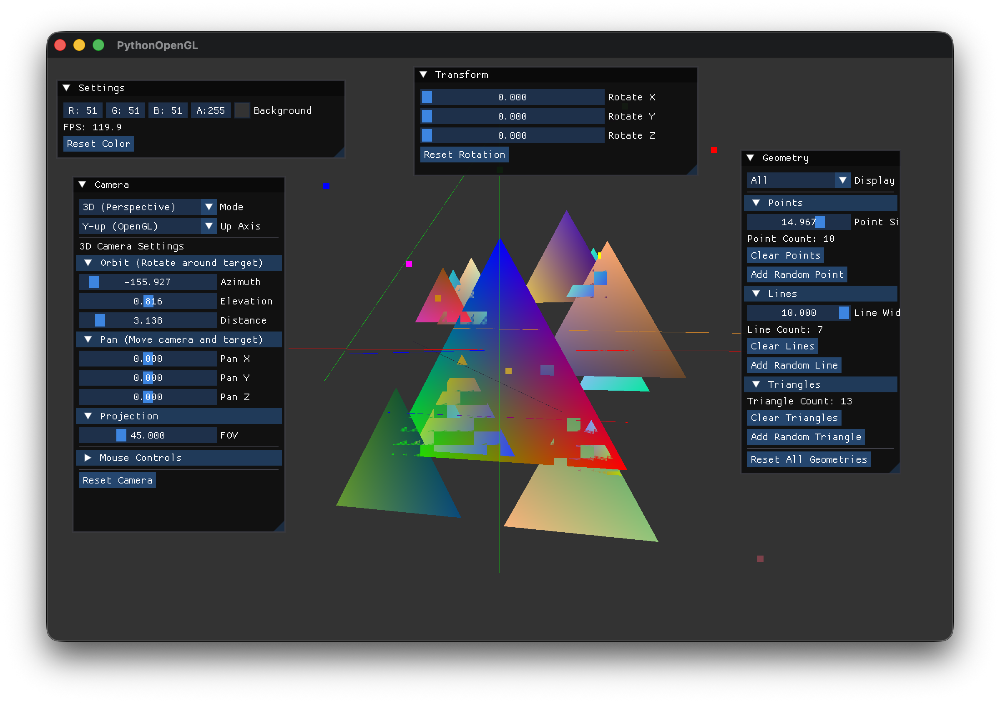
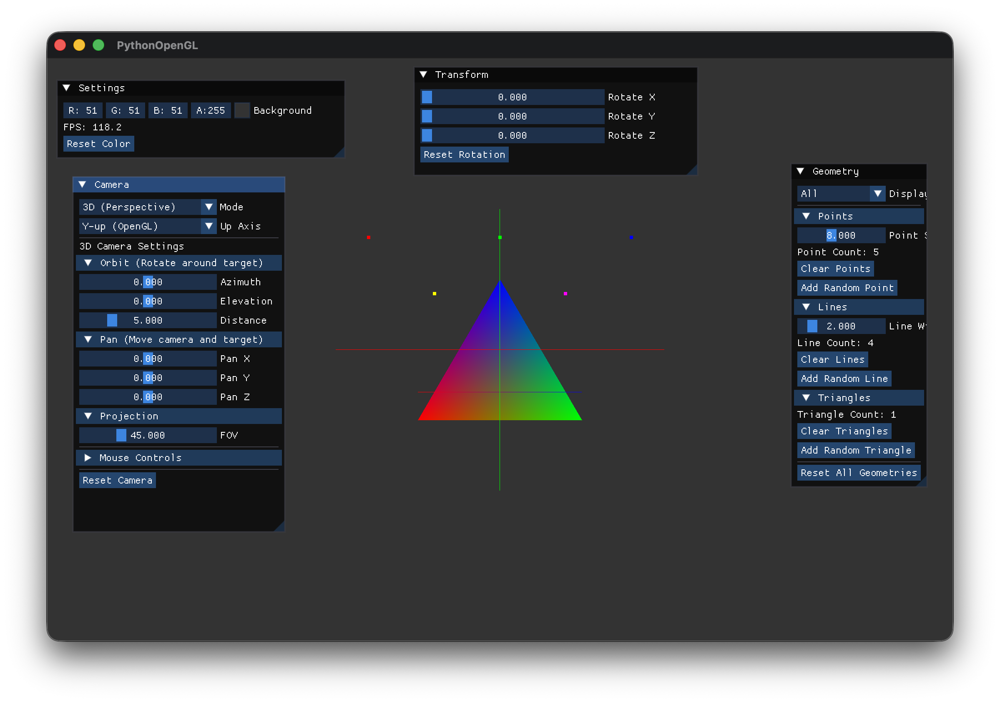

# GitHub Copilotと作る Pythonで OpenGL 3Dプログラミング

## 第8回「点・線・三角形を描く - VBO/VAOの基礎」

[:contents]

### はじめに

前回までで、座標変換とカメラ操作を実装し、3D空間を自由に見回せるようになりました。

今回は、**基本形状（プリミティブ）の描画**を学びます。OpenGLでは、点・線・三角形が最も基本的な描画単位です。これらを効率的に管理するため、**VBO（Vertex Buffer Object）**と**VAO（Vertex Array Object）**の概念を理解し、再利用可能なジオメトリクラスを実装します。

### VBO/VAOとは

これまで三角形を描画するとき、頂点データをシェーダーに渡していました。実は、その裏側ではVBOとVAOが働いています。

#### VBO（Vertex Buffer Object）

VBOは、頂点データをGPUメモリに格納するバッファです。CPUからGPUへのデータ転送は遅いため、頂点データを一度VBOに格納しておくことで、描画のたびにデータを転送する必要がなくなります。

```
CPU側（遅い）          GPU側（速い）
┌────────────┐       ┌────────────┐
│ 頂点データ │ ──→   │    VBO     │ ──→ シェーダー
└────────────┘ 転送  └────────────┘
```

#### VAO（Vertex Array Object）

VAOは、頂点属性の設定を記録するオブジェクトです。「このVBOのこの部分が位置データで、あの部分が色データ」という設定を保存しておくことで、描画時に毎回設定し直す必要がなくなります。

```
VAOが記憶する情報：
┌─────────────────────────────────────────────┐
│ ・どのVBOを使うか                           │
│ ・属性0（位置）: offset=0, 3要素, float型   │
│ ・属性1（色）: offset=12, 3要素, float型    │
│ ・stride（1頂点のバイト数）: 24バイト       │
└─────────────────────────────────────────────┘
```

### OpenGLのプリミティブタイプ

OpenGLがサポートする基本的な描画モードです：

| モード | 説明 | 用途 |
|--------|------|------|
| `GL_POINTS` | 各頂点を点として描画 | パーティクル、デバッグ表示 |
| `GL_LINES` | 2頂点ごとに独立した線分 | 座標軸、ワイヤーフレーム |
| `GL_LINE_STRIP` | 連続した折れ線 | パス、軌跡 |
| `GL_LINE_LOOP` | 折れ線の始点と終点を結ぶ | 閉じた輪郭線 |
| `GL_TRIANGLES` | 3頂点ごとに独立した三角形 | 塗りつぶし面 |
| `GL_TRIANGLE_STRIP` | 連続した三角形（頂点を共有） | メッシュの効率的描画 |
| `GL_TRIANGLE_FAN` | 中心点から扇形に広がる三角形 | 円、扇形 |

今回は`GL_POINTS`、`GL_LINES`、`GL_TRIANGLES`を使います。

### ジオメトリクラスの設計

VBO/VAOの管理を抽象化し、点・線・三角形それぞれに特化したクラスを作成します。

```
GeometryBase（抽象基底クラス）
├── PointGeometry     # GL_POINTS
├── LineGeometry      # GL_LINES
└── TriangleGeometry  # GL_TRIANGLES
```

#### ジオメトリ基底クラス

`src/graphics/geometry.py`:

```python
"""
ジオメトリモジュール

基本形状（点・線・三角形）の描画を提供
"""
from abc import ABC, abstractmethod
from enum import Enum
from typing import List, Tuple, Optional

import numpy as np
import OpenGL.GL as gl

from src.utils.logger import logger


class PrimitiveType(Enum):
    """描画プリミティブタイプ"""
    POINTS = gl.GL_POINTS
    LINES = gl.GL_LINES
    LINE_STRIP = gl.GL_LINE_STRIP
    LINE_LOOP = gl.GL_LINE_LOOP
    TRIANGLES = gl.GL_TRIANGLES
    TRIANGLE_STRIP = gl.GL_TRIANGLE_STRIP
    TRIANGLE_FAN = gl.GL_TRIANGLE_FAN


class GeometryBase(ABC):
    """
    ジオメトリの基底クラス

    VBO/VAOを管理し、描画機能を提供する抽象クラス
    """

    def __init__(self) -> None:
        """ジオメトリを初期化する"""
        self._vao: int = 0
        self._vbo: int = 0
        self._vertex_count: int = 0
        self._is_initialized: bool = False

    @property
    @abstractmethod
    def primitive_type(self) -> PrimitiveType:
        """描画プリミティブタイプを取得"""
        pass

    @property
    def vertex_count(self) -> int:
        """頂点数を取得"""
        return self._vertex_count

    @property
    def is_initialized(self) -> bool:
        """初期化済みかどうか"""
        return self._is_initialized
```

#### VBO/VAOの作成

頂点データ（位置XYZ + 色RGB）をGPUに転送し、属性を設定します：

```python
def _create_buffers(self, vertices: np.ndarray) -> None:
    """
    VBO/VAOを作成する

    Args:
        vertices: 頂点データ（位置x,y,z + 色r,g,b）
    """
    if self._is_initialized:
        self._delete_buffers()

    # VAO（頂点配列オブジェクト）の作成
    self._vao = gl.glGenVertexArrays(1)
    gl.glBindVertexArray(self._vao)

    # VBO（頂点バッファオブジェクト）の作成
    self._vbo = gl.glGenBuffers(1)
    gl.glBindBuffer(gl.GL_ARRAY_BUFFER, self._vbo)
    gl.glBufferData(gl.GL_ARRAY_BUFFER, vertices.nbytes, vertices, gl.GL_STATIC_DRAW)

    # 頂点属性の設定
    stride = 6 * vertices.itemsize  # 1頂点あたり6つのfloat（位置3 + 色3）

    # 属性0: 位置（location = 0）
    gl.glVertexAttribPointer(0, 3, gl.GL_FLOAT, gl.GL_FALSE, stride, None)
    gl.glEnableVertexAttribArray(0)

    # 属性1: 色（location = 1）
    import ctypes
    offset = 3 * vertices.itemsize
    gl.glVertexAttribPointer(1, 3, gl.GL_FLOAT, gl.GL_FALSE, stride, ctypes.c_void_p(offset))
    gl.glEnableVertexAttribArray(1)

    # バインド解除
    gl.glBindBuffer(gl.GL_ARRAY_BUFFER, 0)
    gl.glBindVertexArray(0)

    self._vertex_count = len(vertices) // 6
    self._is_initialized = True
```

**ポイント：**

- `glGenVertexArrays`/`glGenBuffers`: VAO/VBOを生成
- `glBindVertexArray`/`glBindBuffer`: 操作対象を選択
- `glBufferData`: 頂点データをGPUに転送
- `glVertexAttribPointer`: 頂点属性のレイアウトを設定
- `glEnableVertexAttribArray`: 属性を有効化

#### 描画処理

VAOをバインドして`glDrawArrays`を呼ぶだけでシンプルに描画できます：

```python
def draw(self) -> None:
    """ジオメトリを描画する"""
    if not self._is_initialized:
        return

    gl.glBindVertexArray(self._vao)
    gl.glDrawArrays(self.primitive_type.value, 0, self._vertex_count)
    gl.glBindVertexArray(0)
```

VAOのおかげで、描画時に頂点属性を再設定する必要がありません。

### 点ジオメトリ（PointGeometry）

点の描画に特化したクラスです。点のサイズを`glPointSize`で設定できます。

```python
class PointGeometry(GeometryBase):
    """
    点ジオメトリクラス

    GL_POINTSを使用して点を描画
    """

    def __init__(self, points: Optional[List[Tuple[float, ...]]] = None) -> None:
        super().__init__()
        self._points: List[Tuple[float, ...]] = []
        self._point_size: float = 5.0

        if points:
            self._points = list(points)
            self._update_buffers()

    @property
    def primitive_type(self) -> PrimitiveType:
        return PrimitiveType.POINTS

    def set_point_size(self, size: float) -> None:
        """点のサイズを設定"""
        self._point_size = max(1.0, size)

    def add_point(self, x: float, y: float, z: float,
                  r: float = 1.0, g: float = 1.0, b: float = 1.0) -> None:
        """点を追加する"""
        self._points.append((x, y, z, r, g, b))
        self._update_buffers()

    def draw(self) -> None:
        """点を描画する"""
        if not self._is_initialized:
            return

        # 点のサイズを設定
        gl.glPointSize(self._point_size)
        super().draw()
```

### 線ジオメトリ（LineGeometry）

線分の描画に特化したクラスです。単色の線とグラデーション線の両方に対応しています。

```python
class LineGeometry(GeometryBase):
    """
    線ジオメトリクラス

    GL_LINESを使用して線分を描画
    """

    def add_line(self, x1: float, y1: float, z1: float,
                 x2: float, y2: float, z2: float,
                 r: float = 1.0, g: float = 1.0, b: float = 1.0) -> None:
        """線分を追加する（単色）"""
        self._lines.append((
            (x1, y1, z1, r, g, b),
            (x2, y2, z2, r, g, b)
        ))
        self._update_buffers()

    def add_line_colored(self,
                         x1: float, y1: float, z1: float, r1: float, g1: float, b1: float,
                         x2: float, y2: float, z2: float, r2: float, g2: float, b2: float) -> None:
        """線分を追加する（グラデーション）"""
        self._lines.append((
            (x1, y1, z1, r1, g1, b1),
            (x2, y2, z2, r2, g2, b2)
        ))
        self._update_buffers()
```

**Note（macOSの制限）:** macOSのOpenGL Core Profileでは、`glLineWidth()`に1.0より大きい値を設定しても無視されます（またはエラーになります）。これはOpenGL 3.2以降のCore Profileの仕様で、太い線の描画はサポートされていません。そのため、本サンプルではLine Widthのスライダーは省略しています。太い線が必要な場合は、ジオメトリシェーダーで線を矩形に拡張する方法がありますが、それは将来のフェーズで紹介します。

### 三角形ジオメトリ（TriangleGeometry）

三角形の描画に特化したクラスです。塗りつぶされた面を描画できます。

```python
class TriangleGeometry(GeometryBase):
    """
    三角形ジオメトリクラス

    GL_TRIANGLESを使用して三角形を描画
    """

    def add_triangle(self, x1: float, y1: float, z1: float,
                     x2: float, y2: float, z2: float,
                     x3: float, y3: float, z3: float,
                     r: float = 1.0, g: float = 1.0, b: float = 1.0) -> None:
        """三角形を追加する（単色）"""
        self._triangles.append((
            (x1, y1, z1, r, g, b),
            (x2, y2, z2, r, g, b),
            (x3, y3, z3, r, g, b)
        ))
        self._update_buffers()

    def add_triangle_colored(self,
                             x1: float, y1: float, z1: float, r1: float, g1: float, b1: float,
                             x2: float, y2: float, z2: float, r2: float, g2: float, b2: float,
                             x3: float, y3: float, z3: float, r3: float, g3: float, b3: float) -> None:
        """三角形を追加する（頂点ごとに色指定）"""
        self._triangles.append((
            (x1, y1, z1, r1, g1, b1),
            (x2, y2, z2, r2, g2, b2),
            (x3, y3, z3, r3, g3, b3)
        ))
        self._update_buffers()
```

### 深度テストの有効化

3D空間で複数のオブジェクトを描画する場合、手前のものが奥のものを隠す必要があります。これを実現するのが**深度テスト（Depth Test）**です。

```python
def _render(self) -> None:
    """描画処理"""
    # 背景色の適用
    gl.glClearColor(*self._clear_color)

    # 深度テストを有効化（3D描画用）
    gl.glEnable(gl.GL_DEPTH_TEST)

    # 画面のクリア（カラーバッファと深度バッファの両方）
    gl.glClear(int(gl.GL_COLOR_BUFFER_BIT) | int(gl.GL_DEPTH_BUFFER_BIT))

    # ジオメトリの描画
    self._draw_geometries()

    # imguiのレンダリング...
```

**ポイント：**

- `glEnable(GL_DEPTH_TEST)`: 深度テストを有効化
- `glClear(GL_DEPTH_BUFFER_BIT)`: 深度バッファもクリアする必要がある

#### 深度テストの制限

深度テストは「各ピクセルのZ値を比較して、手前にあるものだけを描画する」仕組みです。ただし、以下の場合は期待通りに動作しないことがあります：

1. **同じ深度の面が重なる場合（Z-fighting）**: ほぼ同じZ値の面同士がちらつく
2. **半透明オブジェクト**: 深度値は書き込まれるが、奥のオブジェクトは見えなくなる
3. **描画順序**: 同じ深度の三角形は描画順で決まる

下の画像のように、同じZ値（z=0）に多数の三角形を重ねると、描画順序によって表示が崩れることがあります。これは深度テストの正常な動作であり、バグではありません。


*同じZ座標に複数の三角形を重ねた場合の表示*

より高度な描画（半透明や重なりの正確な処理）には、描画順序の管理やブレンディングの設定が必要になります。これらは後のフェーズで扱います。

### Appクラスへの統合

ジオメトリクラスをAppクラスに組み込み、imguiで操作できるようにします。

```python
def _setup_geometries(self) -> None:
    """ジオメトリをセットアップする"""
    # === 点ジオメトリ ===
    self._point_geometry = PointGeometry()
    self._point_geometry.set_point_size(8.0)
    # サンプルの点を追加
    self._point_geometry.add_point(-0.8, 0.8, 0.0, 1.0, 0.0, 0.0)   # 赤
    self._point_geometry.add_point(0.0, 0.8, 0.0, 0.0, 1.0, 0.0)    # 緑
    self._point_geometry.add_point(0.8, 0.8, 0.0, 0.0, 0.0, 1.0)    # 青

    # === 線ジオメトリ ===
    self._line_geometry = LineGeometry()
    self._line_geometry.set_line_width(2.0)
    # 座標軸
    self._line_geometry.add_line(-1.0, 0.0, 0.0, 1.0, 0.0, 0.0, 1.0, 0.0, 0.0)  # X軸（赤）
    self._line_geometry.add_line(0.0, -1.0, 0.0, 0.0, 1.0, 0.0, 0.0, 1.0, 0.0)  # Y軸（緑）
    self._line_geometry.add_line(0.0, 0.0, -1.0, 0.0, 0.0, 1.0, 0.0, 0.0, 1.0)  # Z軸（青）

    # === 三角形ジオメトリ ===
    self._triangle_geometry = TriangleGeometry()
    # 虹色の三角形
    self._triangle_geometry.add_triangle_colored(
        -0.5, -0.5, 0.0, 1.0, 0.0, 0.0,  # 左下: 赤
        0.5, -0.5, 0.0, 0.0, 1.0, 0.0,   # 右下: 緑
        0.0, 0.5, 0.0, 0.0, 0.0, 1.0     # 上: 青
    )
```

### imguiでインタラクティブに操作

形状の追加・クリア、表示モードの切り替えをimguiで行えるようにしました。

```python
def _draw_geometry_window(self) -> None:
    """形状ウィンドウを描画"""
    imgui.begin("Geometry")

    # 表示モードの選択
    mode_names = ["Points", "Lines", "Triangles", "All"]
    changed, self._geometry_mode = imgui.combo("Display Mode", self._geometry_mode, mode_names)

    # === 点の設定 ===
    if imgui.collapsing_header("Points", imgui.TreeNodeFlags_.default_open.value):
        if self._point_geometry:
            # 点のサイズ
            changed_size, size = imgui.slider_float(
                "Point Size", self._point_geometry.point_size, 1.0, 20.0
            )
            if changed_size:
                self._point_geometry.set_point_size(size)

            imgui.text(f"Point Count: {self._point_geometry.vertex_count}")

            if imgui.button("Clear Points"):
                self._point_geometry.clear()

            if imgui.button("Add Random Point"):
                import random
                x = random.uniform(-1.0, 1.0)
                y = random.uniform(-1.0, 1.0)
                z = random.uniform(-0.5, 0.5)
                r, g, b = random.random(), random.random(), random.random()
                self._point_geometry.add_point(x, y, z, r, g, b)

    # ... 線・三角形も同様 ...

    imgui.end()
```

### 実行結果

起動すると、点・線・三角形が表示されます。imguiのGeometryパネルで：

- **Display Mode**: 表示する形状を切り替え
- **Add Random**: ランダムな位置に形状を追加
- **Clear**: 各形状をクリア
- **Point Size**: 点のサイズ調整（スライダー）


*点・線・三角形の基本形状を表示*

カメラ操作（ドラッグ・スクロール）も引き続き使用できます。

### リソースの解放

OpenGLのリソース（VBO/VAO）は、使い終わったら明示的に解放する必要があります。

```python
def cleanup(self) -> None:
    """リソースを解放する"""
    self._delete_buffers()

def _delete_buffers(self) -> None:
    """VBO/VAOを削除する"""
    if self._vbo:
        gl.glDeleteBuffers(1, [self._vbo])
        self._vbo = 0
    if self._vao:
        gl.glDeleteVertexArrays(1, [self._vao])
        self._vao = 0
    self._is_initialized = False
```

Appの終了処理で各ジオメトリの`cleanup()`を呼び出します：

```python
def _shutdown(self) -> None:
    """終了処理"""
    # ジオメトリリソースの解放
    if self._point_geometry:
        self._point_geometry.cleanup()
    if self._line_geometry:
        self._line_geometry.cleanup()
    if self._triangle_geometry:
        self._triangle_geometry.cleanup()

    # シェーダーの解放
    if self._shader:
        self._shader.delete()
    # ...
```

### ディレクトリ構成

今回追加・変更したファイル：

```
src/
├── main.py           # エントリポイント（変更なし）
├── core/
│   └── app.py        # ジオメトリ管理・imgui UI追加
├── graphics/
│   ├── __init__.py   # エクスポート追加
│   └── geometry.py   # 新規：ジオメトリクラス群
└── shaders/          # （変更なし）
```

### まとめ

今回学んだこと：

1. **VBO（Vertex Buffer Object）**: 頂点データをGPUに格納
2. **VAO（Vertex Array Object）**: 頂点属性の設定を記録
3. **プリミティブタイプ**: GL_POINTS, GL_LINES, GL_TRIANGLES
4. **深度テスト**: 3D描画での前後関係を正しく表示
5. **リソース管理**: 使い終わったVBO/VAOは明示的に解放

ジオメトリクラスで抽象化したことで、点・線・三角形を簡単に追加・描画できるようになりました。

次回は、これを発展させて**立方体や球体**などの複合形状を描画します。インデックスバッファ（EBO）を使った効率的な頂点管理も学びます。

### ソースコード

今回のコードは以下のGitHubリポジトリで公開しています。

- リポジトリ: [https://github.com/an-embedded-engineer/PythonOpenGLBlog](https://github.com/an-embedded-engineer/PythonOpenGLBlog)
- タグ: `v6a.0`

### 次回予告

第9回「立方体と球体を描く」では：

- インデックスバッファ（EBO）の使用
- 四角形の描画
- 立方体と球体の頂点データ生成
- ワイヤーフレーム表示

お楽しみに！

---

**前回**: [第7回「マウスでカメラ操作」](https://an-embedded-engineer.hateblo.jp/entry/2025/12/01/221459)

**次回**: 第9回「立方体と球体を描く」（準備中）
