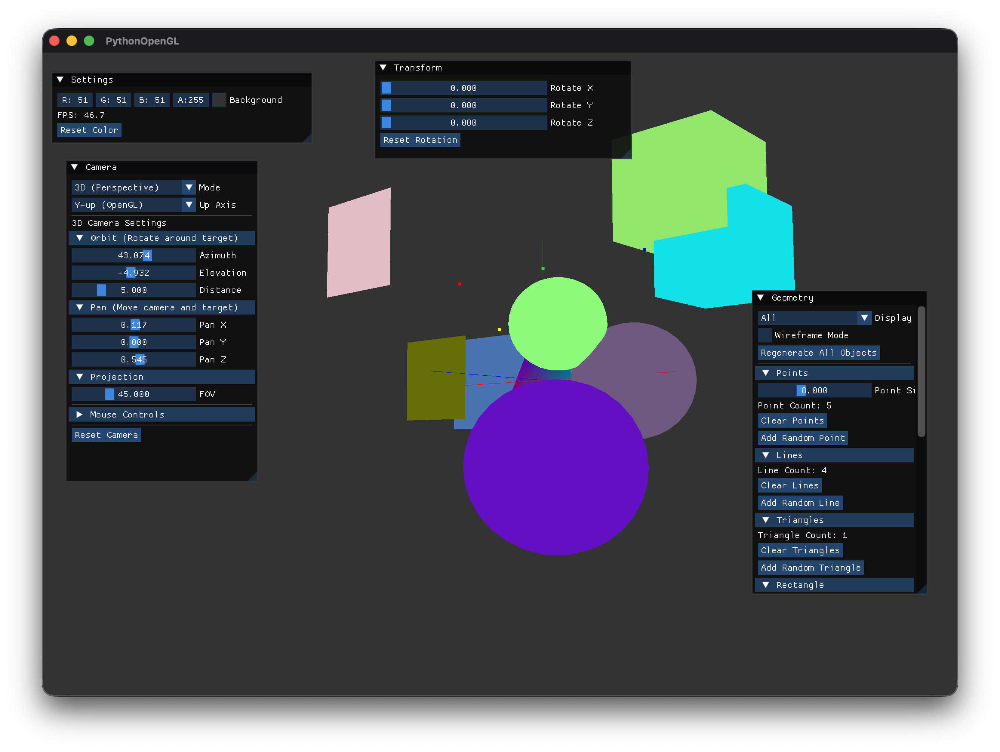
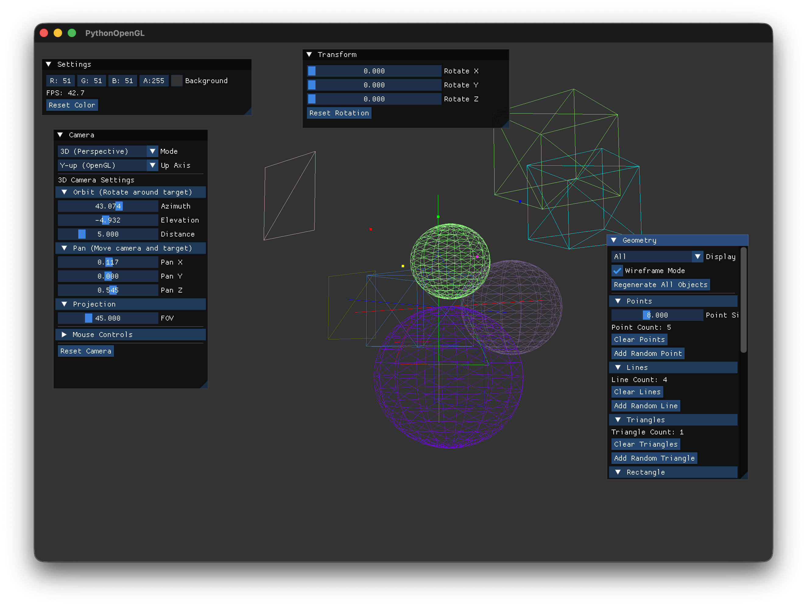
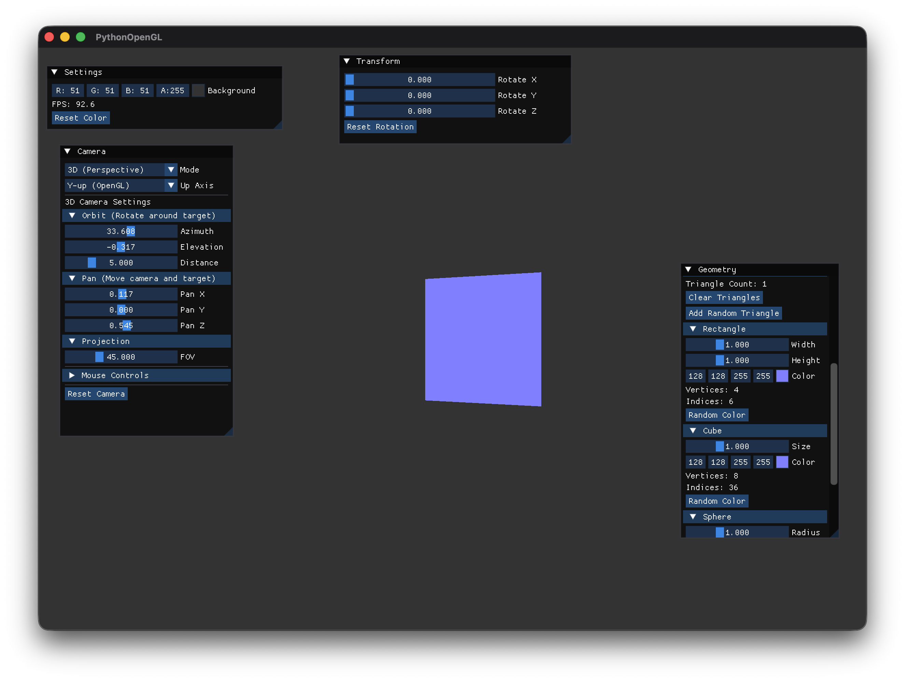
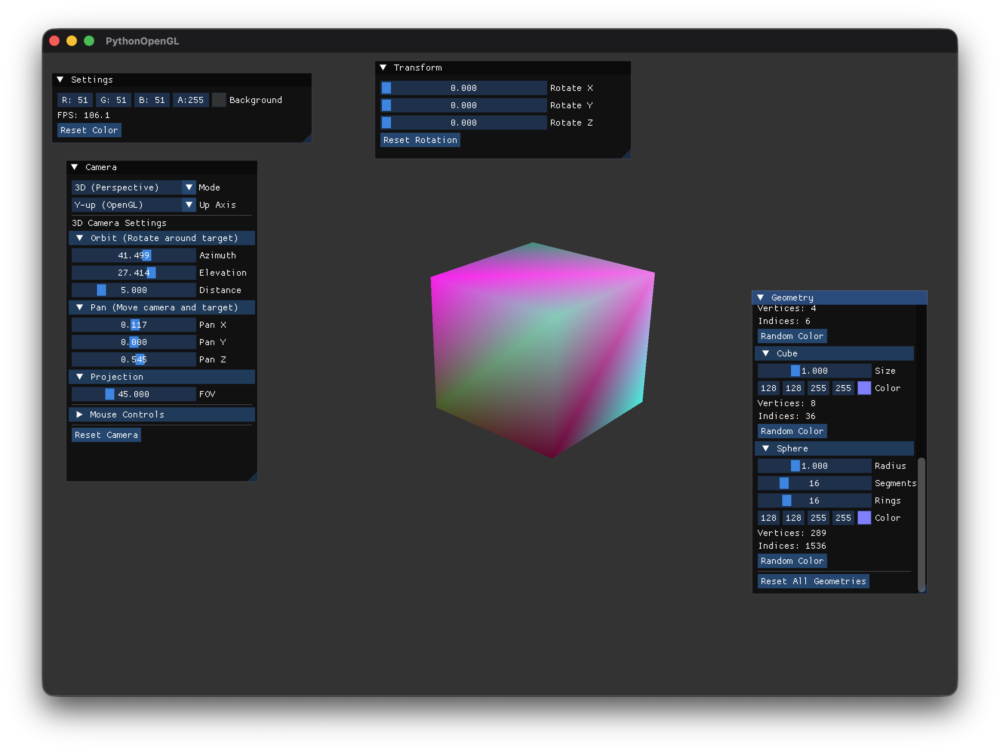
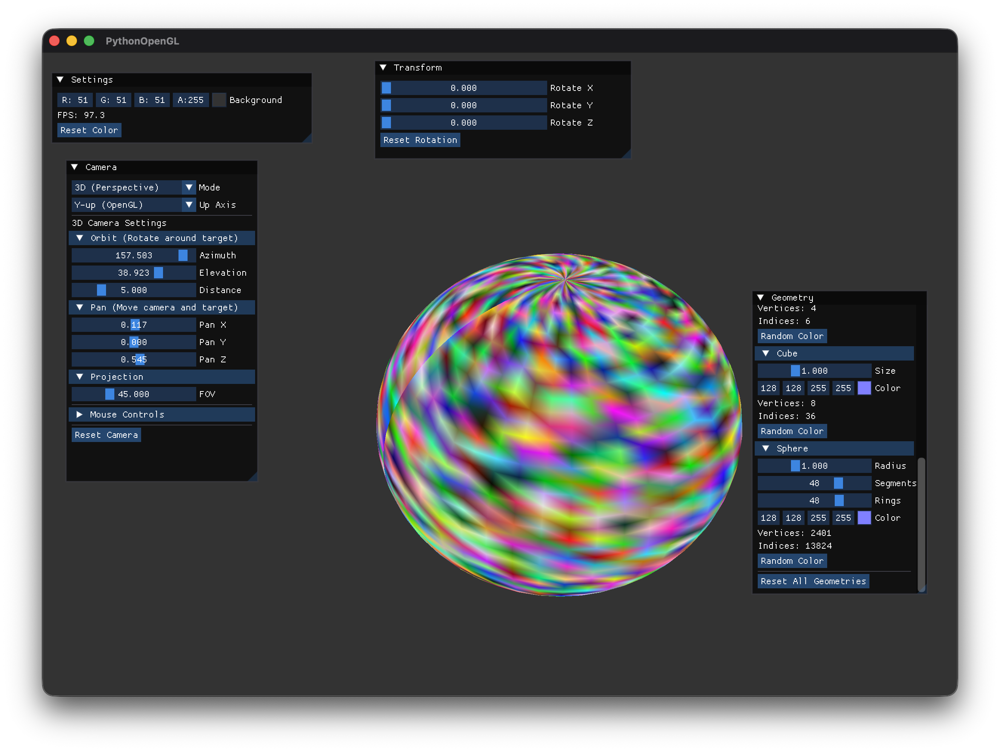

# GitHub Copilotと作る Pythonで OpenGL 3Dプログラミング

## 第9回「立方体と球体を描く - EBOで頂点を再利用」

[:contents]

### はじめに

前回は、点・線・三角形という基本形状（プリミティブ）の描画を学び、VBO/VAOの概念を理解しました。

今回は、**EBO（Element Buffer Object / Index Buffer）**を使って、より複雑な形状を効率的に描画する方法を学びます。具体的には、**矩形（Rectangle）**、**立方体（Cube）**、**球体（Sphere）**の描画を実装します。

また、OpenGL操作を抽象化する**BufferManagerパターン**を導入し、テスト容易性を向上させます。

### BufferManagerパターンの実装

複雑な形状を実装する前に、まずOpenGL操作を抽象化する設計パターンを導入します。これにより、以下のメリットが得られます：

1. **テスト容易性**: OpenGLコンテキスト不要でユニットテストが可能
2. **依存性注入**: 実装とテストを切り離せる
3. **保守性**: OpenGL呼び出しが一箇所に集約される

#### BufferManager Protocol

`src/graphics/geometry.py`:

```python
class BufferManager(Protocol):
    """OpenGL操作の抽象化インターフェース"""

    def create_buffers(
        self,
        vertices: np.ndarray,
        primitive_type: PrimitiveType
    ) -> tuple[int, int]:
        """VBO/VAOを作成"""
        ...

    def create_indexed_buffers(
        self,
        vertices: np.ndarray,
        indices: np.ndarray,
        primitive_type: PrimitiveType
    ) -> tuple[int, int, int]:
        """VBO/VAO/EBOを作成"""
        ...

    def draw_arrays(self, vao: int, vertex_count: int, primitive_type: PrimitiveType) -> None:
        """通常描画（VBOのみ）"""
        ...

    def draw_elements(self, vao: int, index_count: int, primitive_type: PrimitiveType) -> None:
        """インデックス描画（VBO + EBO）"""
        ...
```

実装クラス`OpenGLBufferManager`が実際のOpenGL関数を呼び出します。

### BufferManagerのテスト容易性

このパターンにより、`MockBufferManager`を使ってOpenGLコンテキスト不要なユニットテストを実現できます：

```python
# tests/test_geometry.py
class MockBufferManager:
    """テスト用のモックBufferManager"""

    def create_indexed_buffers(self, vertices, indices, primitive_type):
        # 実際のOpenGL呼び出しなし、ダミーID返却
        return (1, 2, 3)  # VAO, VBO, EBO

    def draw_elements(self, vao, index_count, primitive_type):
        # 描画記録のみ
        self.draw_calls.append(("elements", vao, index_count))

# テスト例
def test_rectangle_init():
    mock = MockBufferManager()
    rect = RectangleGeometry(width=2.0, height=1.5, buffer_manager=mock)

    assert rect.vertex_count == 4
    assert rect.index_count == 6
    assert mock.created_buffers_count == 1
```

全22テストがOpenGL初期化なしで実行可能です：

```bash
pytest tests/test_geometry.py -v
# ====================== 22 passed in 0.64s ======================
```

### EBOとは何か？

#### 頂点の重複問題

前回の三角形描画では、頂点データを直接VBOに格納していました。しかし、複雑な形状を描く場合、同じ頂点を複数回使い回す必要があります。

例えば、矩形（四角形）を三角形で描く場合：

```
三角形2つで矩形を構成
┌───────┐
│ ＼    │
│   ＼  │  三角形1: (0, 1, 2)
│     ＼│  三角形2: (0, 2, 3)
└───────┘

頂点データ（重複なし）：
0: (-0.5, -0.5)  左下
1: ( 0.5, -0.5)  右下
2: ( 0.5,  0.5)  右上
3: (-0.5,  0.5)  左上
```

VBOだけで描画する場合、6頂点（3頂点×2三角形）を送る必要があり、頂点0と頂点2が重複します。

#### EBOによる解決

**EBO（Element Buffer Object）**は、頂点のインデックス（番号）を格納するバッファです。頂点データは一度だけVBOに格納し、EBOで「どの順番で頂点を使うか」を指定します。

```
VBO: 頂点データ4つ
┌────┬────┬────┬────┐
│ 0  │ 1  │ 2  │ 3  │
└────┴────┴────┴────┘

EBO: インデックスデータ6つ
┌────┬────┬────┬────┬────┬────┐
│ 0  │ 1  │ 2  │ 0  │ 2  │ 3  │
└────┴────┴────┴────┴────┴────┘
 └─────────┘  └─────────┘
  三角形1       三角形2
```

これにより、頂点データの重複を削減し、**メモリ効率**と**転送効率**が向上します。

### 矩形（Rectangle）の実装

#### 頂点データとインデックス

4頂点で矩形を構成し、2つの三角形で描画します：

```python
class RectangleGeometry(GeometryBase):
    def _update_buffers(self) -> None:
        w = self._width / 2.0
        h = self._height / 2.0
        r, g, b = self._color

        # 頂点データ（4頂点）
        vertices = np.array([
            # 位置           色
            -w, -h, 0.0,  r, g, b,  # 左下
             w, -h, 0.0,  r, g, b,  # 右下
             w,  h, 0.0,  r, g, b,  # 右上
            -w,  h, 0.0,  r, g, b,  # 左上
        ], dtype=np.float32)

        # インデックスデータ（2三角形 = 6インデックス）
        indices = np.array([
            0, 1, 2,  # 三角形1（左下・右下・右上）
            0, 2, 3,  # 三角形2（左下・右上・左上）
        ], dtype=np.uint32)

        # EBOを使用してバッファ作成
        self._vao, self._vbo, self._ebo = self._buffer_manager.create_indexed_buffers(
            vertices, indices, PrimitiveType.TRIANGLES
        )
```

#### サイズ・色の変更

```python
def set_size(self, width: float, height: float) -> None:
    """サイズを変更"""
    self._width = width
    self._height = height
    self._update_buffers()

def set_color(self, r: float, g: float, b: float) -> None:
    """色を変更"""
    self._color = (r, g, b)
    self._update_buffers()
```

### 立方体（Cube）の実装

#### 立方体の構造

立方体は**8頂点**、**6面**（各面は2三角形）で構成されます：

```
立方体の頂点番号
      7-------6
     /|      /|
    4-------5 |
    | |     | |
    | 3-----|-2
    |/      |/
    0-------1

各面のインデックス（反時計回り）：
前面: 0, 1, 5, 0, 5, 4
右面: 1, 2, 6, 1, 6, 5
背面: 2, 3, 7, 2, 7, 6
左面: 3, 0, 4, 3, 4, 7
上面: 4, 5, 6, 4, 6, 7
底面: 3, 2, 1, 3, 1, 0
```

合計：8頂点、36インデックス（12三角形）

#### 頂点データとインデックス

```python
class CubeGeometry(GeometryBase):
    def _update_buffers(self) -> None:
        s = self._size / 2.0
        r, g, b = self._color

        # 8頂点（各頂点に色を付与）
        vertices = np.array([
            # 位置              色
            -s, -s, -s,  r, g, b,  # 0: 左下前
             s, -s, -s,  r, g, b,  # 1: 右下前
             s,  s, -s,  r, g, b,  # 2: 右上前
            -s,  s, -s,  r, g, b,  # 3: 左上前
            -s, -s,  s,  r, g, b,  # 4: 左下奥
             s, -s,  s,  r, g, b,  # 5: 右下奥
             s,  s,  s,  r, g, b,  # 6: 右上奥
            -s,  s,  s,  r, g, b,  # 7: 左上奥
        ], dtype=np.float32)

        # 6面×2三角形 = 36インデックス
        indices = np.array([
            0, 1, 5, 0, 5, 4,  # 前面
            1, 2, 6, 1, 6, 5,  # 右面
            2, 3, 7, 2, 7, 6,  # 背面
            3, 0, 4, 3, 4, 7,  # 左面
            4, 5, 6, 4, 6, 7,  # 上面
            3, 2, 1, 3, 1, 0,  # 底面
        ], dtype=np.uint32)

        self._vao, self._vbo, self._ebo = self._buffer_manager.create_indexed_buffers(
            vertices, indices, PrimitiveType.TRIANGLES
        )
```

### 球体（Sphere）の実装

#### 球面の数式

球体は**経度（longitude）**と**緯度（latitude）**で分割して生成します。

球面上の点 (x, y, z) は、半径 r、経度 θ（シータ）、緯度 φ（ファイ）から計算します：

```
x = r × cos(φ) × cos(θ)
y = r × sin(φ)
z = r × cos(φ) × sin(θ)
```

- **θ（経度）**: 0〜2π、水平方向の角度
- **φ（緯度）**: -π/2〜π/2、垂直方向の角度

#### 頂点生成アルゴリズム

```python
def _generate_vertices(self) -> tuple[np.ndarray, np.ndarray]:
    vertices = []
    indices = []

    # 各リング（緯度方向）
    for i in range(self._rings + 1):
        phi = np.pi / 2 - i * np.pi / self._rings  # π/2 → -π/2

        # 各セグメント（経度方向）
        for j in range(self._segments + 1):
            theta = j * 2 * np.pi / self._segments  # 0 → 2π

            x = self._radius * np.cos(phi) * np.cos(theta)
            y = self._radius * np.sin(phi)
            z = self._radius * np.cos(phi) * np.sin(theta)

            vertices.extend([x, y, z, *self._color])

    # インデックス生成（各四角形を2三角形に分割）
    for i in range(self._rings):
        for j in range(self._segments):
            first = i * (self._segments + 1) + j
            second = first + self._segments + 1

            # 三角形1
            indices.extend([first, second, first + 1])
            # 三角形2
            indices.extend([second, second + 1, first + 1])

    return np.array(vertices, dtype=np.float32), np.array(indices, dtype=np.uint32)
```

#### 頂点数・インデックス数

- **頂点数**: (rings + 1) × (segments + 1)
- **インデックス数**: rings × segments × 6

例：`segments=16, rings=16`の場合：
- 頂点数: 17 × 17 = 289
- インデックス数: 16 × 16 × 6 = 1536

### アプリケーションへの統合

#### 形状の初期化

`src/core/app.py`:

```python
def _setup_geometries(self) -> None:
    """ジオメトリをセットアップする"""
    # === 矩形ジオメトリ ===
    self._rectangle_geometry = RectangleGeometry(
        width=1.0,
        height=1.0,
        r=0.5, g=0.5, b=1.0,
    )

    # === 立方体ジオメトリ ===
    self._cube_geometry = CubeGeometry(
        size=1.0,
        r=0.5, g=0.5, b=1.0,
    )

    # === 球体ジオメトリ ===
    self._sphere_geometry = SphereGeometry(
        radius=1.0,
        segments=16,
        rings=16,
        r=0.5, g=0.5, b=1.0,
    )
```

#### imgui UI

形状選択、サイズ調整、色変更を可能にします：

```python
def _draw_geometry_window(self) -> None:
    imgui.begin("Geometry")

    # 表示モードの選択
    mode_names = ["Points", "Lines", "Triangles", "All", "Rectangle", "Cube", "Sphere"]
    changed, self._geometry_mode = imgui.combo("Display Mode", self._geometry_mode, mode_names)

    # === 矩形の設定 ===
    if imgui.collapsing_header("Rectangle", imgui.TreeNodeFlags_.default_open.value):
        changed_w, self._rectangle_width = imgui.slider_float("Width", self._rectangle_width, 0.1, 3.0)
        changed_h, self._rectangle_height = imgui.slider_float("Height", self._rectangle_height, 0.1, 3.0)
        if changed_w or changed_h:
            self._rectangle_geometry.set_size(self._rectangle_width, self._rectangle_height)

    # === 立方体の設定 ===
    if imgui.collapsing_header("Cube"):
        changed_s, self._cube_size = imgui.slider_float("Size", self._cube_size, 0.1, 3.0)
        if changed_s:
            self._cube_geometry.set_size(self._cube_size)

    # === 球体の設定 ===
    if imgui.collapsing_header("Sphere"):
        changed_r, self._sphere_radius = imgui.slider_float("Radius", self._sphere_radius, 0.1, 3.0)
        changed_seg, self._sphere_segments = imgui.slider_int("Segments", self._sphere_segments, 4, 64)
        changed_ring, self._sphere_rings = imgui.slider_int("Rings", self._sphere_rings, 2, 64)

        if changed_r or changed_seg or changed_ring:
            # 球体を再生成
            self._sphere_geometry.cleanup()
            self._sphere_geometry = SphereGeometry(
                radius=self._sphere_radius,
                segments=self._sphere_segments,
                rings=self._sphere_rings,
                r=self._shape_color[0],
                g=self._shape_color[1],
                b=self._shape_color[2],
            )

    imgui.end()
```

#### 描画処理

```python
def _draw_geometries(self) -> None:
    # ... Model/View/Projection行列設定 ...

    if self._geometry_mode == 4:  # Rectangle
        if self._rectangle_geometry:
            self._rectangle_geometry.draw()

    if self._geometry_mode == 5:  # Cube
        if self._cube_geometry:
            self._cube_geometry.draw()

    if self._geometry_mode == 6:  # Sphere
        if self._sphere_geometry:
            self._sphere_geometry.draw()
```

### 実行結果

アプリケーションを実行すると：

```bash
source .venv/bin/activate && python -m src.main
```

1. **Geometry**ウィンドウで`Display Mode`を選択
2. `Rectangle`、`Cube`、`Sphere`を選択すると各形状が表示される
3. パラメータを調整して、サイズ・色・分割数を変更できる
4. **Transform**ウィンドウで回転させて立体感を確認
5. **Wireframe Mode**で形状の構造を確認
6. **Random Color**ボタンで各頂点にランダムな色を設定し、グラデーション効果を楽しめる

#### Allモード - 複数オブジェクトの描画



Point/Line/Triangle + Rectangle/Cube/Sphere（各3個）を同時に表示。ランダムな位置・スケール・色で配置される。

#### Wireframeモード - 構造の可視化



立方体や球体の三角形分割構造が明確に見える。

#### Rectangle - デフォルト色表示



4頂点、6インデックス（2三角形）で構成される矩形。

#### Cube - ランダム色グラデーション



8頂点それぞれに異なる色を設定。各面がカラフルなグラデーションになる。

#### Sphere - ランダム色グラデーション



全頂点に異なる色を設定。経度・緯度分割による美しいグラデーション球体。

### まとめ

今回は、**EBO（インデックスバッファ）**を使って複雑な形状を効率的に描画する方法を学びました。

**学んだこと**：
1. BufferManagerパターンによるテスト容易性
2. EBOによる頂点の再利用（メモリ効率向上）
3. 矩形の実装（4頂点、6インデックス）
4. 立方体の実装（8頂点、36インデックス）
5. 球体の生成アルゴリズム（経度・緯度分割）

**次回予告**：
次回は、「**バッチ描画による高速化**」を実装します。複数オブジェクトの描画を効率化し、ドローコールのオーバーヘッドを削減します。

---

**前回**: [第8回「点・線・三角形を描く」](https://an-embedded-engineer.hateblo.jp/entry/2025/12/06/015110)

**次回**: 第10回「バッチ描画による高速化」（準備中）
