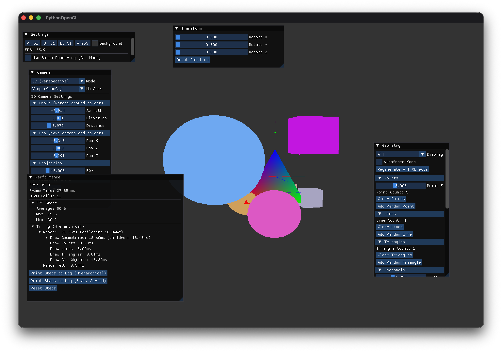
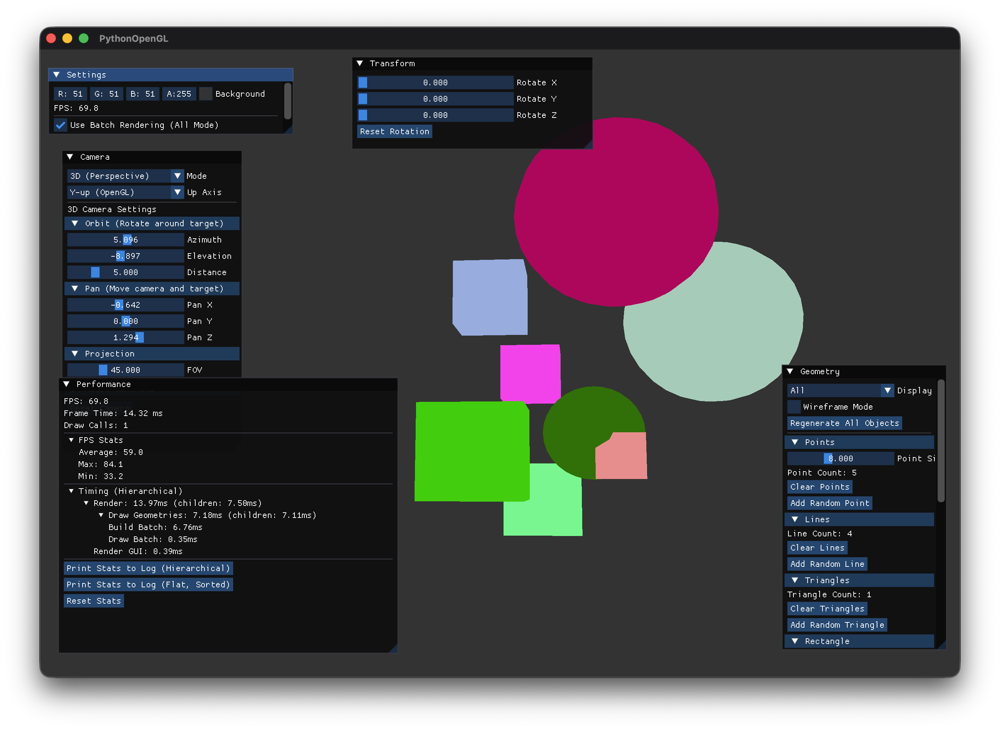

# GitHub Copilotと作る Pythonで OpenGL 3Dプログラミング

## 第10回「バッチレンダリングで描画を高速化」

[:contents]

### はじめに

前回は、立方体や球体といった複雑な形状をEBO（Element Buffer Object）を使って効率的に描画する方法を学びました。

今回は、**バッチレンダリング（Batch Rendering）**を実装して、描画パフォーマンスを大幅に向上させる方法を学びます。複数のオブジェクトを**1回のドローコール**でまとめて描画することで、ドローコールを劇的に削減し、FPSを大幅に向上させることができます。

また、パフォーマンス計測のための**PerformanceManager**も実装し、最適化の効果を定量的に評価できるようにします。

### なぜバッチレンダリングが必要なのか？

#### ドローコールのコスト

現在の実装では、各オブジェクトごとに個別の描画命令（ドローコール）を発行しています：

```python
# 従来の方法：各オブジェクトで個別にdraw()
for obj in objects:
    transform.set_model_identity()
    transform.translate(obj['pos'])
    transform.scale(obj['scale'])
    shader.set_mat4("model", transform.model)
    geometry.draw()  # ← ドローコール発生
```

**問題点**：
- オブジェクト数に比例してドローコールが増加
- CPU-GPU間の通信オーバーヘッドが大きい
- 現代のGPUは少数の大きな描画を得意とする

### パフォーマンス計測基盤の実装

最適化の効果を測定するため、まずパフォーマンス計測の仕組みを実装します。

#### PerformanceManager クラス

`src/utils/performance.py`:

```python
from dataclasses import dataclass
from typing import Dict, Optional
import time

@dataclass
class PerformanceStats:
    """パフォーマンス統計情報"""
    fps: float
    frame_time_ms: float
    timing_stats: Dict[str, float]
    hierarchical_stats: Dict[str, any]

class PerformanceManager:
    """パフォーマンス計測マネージャー"""

    def __init__(self):
        self._frame_times: list[float] = []
        self._timing_stats: Dict[str, float] = {}
        self._operation_stack: list[tuple[str, float]] = []
        self._draw_call_count: int = 0
        self._current_fps: float = 0.0

    def begin_frame(self) -> None:
        """フレーム開始"""
        self._frame_start_time = time.time()
        self._timing_stats.clear()
        self._draw_call_count = 0

    def end_frame(self) -> None:
        """フレーム終了"""
        frame_time = time.time() - self._frame_start_time
        self._frame_times.append(frame_time)

        # 10フレームごとにFPS計算
        if len(self._frame_times) >= 10:
            avg_time = sum(self._frame_times[-10:]) / 10
            self._current_fps = 1.0 / avg_time if avg_time > 0 else 0.0

    def time_operation(self, name: str):
        """処理時間計測用コンテキストマネージャー"""
        return OperationTimer(self, name)

    def set_draw_call_count(self, count: int) -> None:
        """ドローコール数を記録"""
        self._draw_call_count = count
```

#### OperationTimer コンテキストマネージャー

```python
class OperationTimer:
    """処理時間計測用コンテキストマネージャー"""

    def __init__(self, manager: PerformanceManager, name: str):
        self._manager = manager
        self._name = name
        self._start_time = 0.0

    def __enter__(self):
        self._start_time = time.time()
        return self

    def __exit__(self, exc_type, exc_val, exc_tb):
        elapsed = time.time() - self._start_time
        self._manager._record_operation(self._name, elapsed)
        return False
```

#### 使用例

```python
# App.pyのメインループ
def run(self):
    while not self._window.should_close():
        performance_manager.begin_frame()

        with performance_manager.time_operation("Render"):
            self._render()

        performance_manager.end_frame()
```

### バッチレンダリングの仕組み

バッチレンダリングの基本的な考え方は、**複数のオブジェクトの頂点データを1つのバッファに結合し、1回のドローコールで描画する**ことです。

#### 実装の流れ

```
1. 各オブジェクトの頂点データを取得
   ↓
2. Transform行列を適用して頂点座標を変換 (CPU側)
   ↓
3. 全オブジェクトの頂点を1つの配列に結合
   ↓
4. 結合したデータでVBO/EBOを作成
   ↓
5. 1回のドローコールで全て描画
```

**重要なポイント**：
- Transform行列の適用をCPU側で行う（GPU側では単位行列を使用）
- インデックスのオフセット調整が必要
- 同じプリミティブタイプ（TRIANGLES, POINTS, LINES）でグループ化

#### BatchRenderer クラス

`src/graphics/batch_renderer.py`:

```python
from dataclasses import dataclass
from typing import List, Optional
import numpy as np
import OpenGL.GL as gl

@dataclass
class RenderBatch:
    """1つのジオメトリの描画情報"""
    vertices: np.ndarray           # 頂点データ（Nx6: x,y,z,r,g,b）
    indices: Optional[np.ndarray]  # インデックスデータ
    transform: np.ndarray          # Model変換行列（4x4）
    vertex_offset: int = 0         # 結合後のオフセット
    vertex_count: int = 0          # 頂点数
    index_offset: int = 0          # インデックスオフセット
    index_count: int = 0           # インデックス数

class BatchRenderer:
    """バッチレンダリングクラス"""

    def __init__(self, primitive_type: PrimitiveType):
        self._primitive_type = primitive_type
        self._batches: List[RenderBatch] = []
        self._vao: int = 0
        self._vbo: int = 0
        self._ebo: int = 0
        self._is_dirty: bool = False
        self._use_indices: bool = False

    def add_geometry(self,
                     vertices: np.ndarray,
                     indices: Optional[np.ndarray],
                     transform: np.ndarray) -> None:
        """ジオメトリをバッチに追加"""
        batch = RenderBatch(
            vertices=vertices.copy(),
            indices=indices.copy() if indices is not None else None,
            transform=transform.copy(),
            vertex_count=len(vertices)
        )
        self._batches.append(batch)
        self._is_dirty = True

    def build(self) -> None:
        """バッチをビルド（頂点結合、バッファ作成）"""
        if not self._batches or not self._is_dirty:
            return

        # 1. Transform適用
        transformed_batches = []
        vertex_offset = 0

        for batch in self._batches:
            # 頂点にTransformを適用
            transformed_verts = self._apply_transform(
                batch.vertices,
                batch.transform
            )
            transformed_batches.append(transformed_verts)

            batch.vertex_offset = vertex_offset
            vertex_offset += batch.vertex_count

        # 2. 頂点データを結合
        combined_vertices = np.concatenate(transformed_batches, axis=0)

        # 3. インデックスデータを結合
        combined_indices = None
        if self._use_indices:
            combined_indices = self._combine_indices()

        # 4. OpenGLバッファを作成
        self._create_buffers(combined_vertices, combined_indices)

        self._is_dirty = False

    def flush(self) -> None:
        """バッチを描画"""
        if self._is_dirty:
            self.build()

        if self._vao == 0:
            return

        gl.glBindVertexArray(self._vao)

        if self._use_indices:
            gl.glDrawElements(
                self._primitive_type.value,
                self._total_indices,
                gl.GL_UNSIGNED_INT,
                None
            )
        else:
            gl.glDrawArrays(
                self._primitive_type.value,
                0,
                self._total_vertices
            )

        gl.glBindVertexArray(0)
```

### Transform行列の適用

バッチレンダリングでは、各オブジェクトのTransform行列をCPU側で頂点に適用します。

#### _apply_transform メソッド

```python
def _apply_transform(self,
                     vertices: np.ndarray,
                     transform: np.ndarray) -> np.ndarray:
    """頂点データにTransform行列を適用"""
    # 位置（xyz）と色（rgb）を分離
    positions = vertices[:, :3]  # (N, 3)
    colors = vertices[:, 3:6]    # (N, 3)

    # 同次座標に変換（w=1を追加）
    positions_homogeneous = np.hstack([
        positions,
        np.ones((len(positions), 1))
    ])  # (N, 4)

    # Transform行列を適用
    transformed_positions = (transform @ positions_homogeneous.T).T

    # 同次座標から3D座標に戻す（wで除算）
    transformed_positions = (
        transformed_positions[:, :3] /
        transformed_positions[:, 3:4]
    )

    # 位置と色を再結合
    result = np.hstack([transformed_positions, colors])

    return result.astype(np.float32)
```

**ポイント**：
- 位置座標のみを変換（色は変換しない）
- 同次座標（x, y, z, w）で計算
- 最後にwで除算して3D座標に戻す

### インデックスの結合

複数のジオメトリのインデックスを結合する際は、頂点オフセットを考慮する必要があります。

#### _combine_indices メソッド

```python
def _combine_indices(self) -> Optional[np.ndarray]:
    """インデックスを結合（オフセット調整付き）"""
    combined = []

    for batch in self._batches:
        if batch.indices is not None:
            # 頂点オフセットを加算
            adjusted_indices = batch.indices + batch.vertex_offset
            combined.append(adjusted_indices)

    if combined:
        return np.concatenate(combined, axis=0).astype(np.uint32)

    return None
```

**例**：
- オブジェクト1: 頂点0-3、インデックス[0,1,2, 2,3,0]
- オブジェクト2: 頂点4-7、インデックス[0,1,2, 2,3,0] → [4,5,6, 6,7,4]に調整

### GeometryBase拡張: get_vertex_data()

各ジオメトリクラスに、バッチレンダリング用の頂点データ取得メソッドを追加します。

#### GeometryBaseの抽象メソッド

`src/graphics/geometry.py`:

```python
from abc import ABC, abstractmethod

class GeometryBase(ABC):
    """ジオメトリの基底クラス"""

    @abstractmethod
    def get_vertex_data(self) -> Tuple[np.ndarray, Optional[np.ndarray]]:
        """
        バッチレンダリング用の頂点データを取得

        Returns:
            (vertices, indices): 頂点データとインデックスデータ
            vertices: Nx6 array (x,y,z,r,g,b)
            indices: インデックス配列（Optional）
        """
        pass
```

#### 実装例: RectangleGeometry

```python
class RectangleGeometry(GeometryBase):
    """矩形ジオメトリクラス"""

    def get_vertex_data(self) -> Tuple[np.ndarray, Optional[np.ndarray]]:
        """バッチレンダリング用の頂点データを取得"""
        w = self._width / 2.0
        h = self._height / 2.0
        r, g, b = self._color

        # 4頂点
        vertices = np.array([
            -w, -h, 0.0,  r, g, b,  # 左下
             w, -h, 0.0,  r, g, b,  # 右下
             w,  h, 0.0,  r, g, b,  # 右上
            -w,  h, 0.0,  r, g, b,  # 左上
        ], dtype=np.float32).reshape(4, 6)

        # 6インデックス（2三角形）
        indices = np.array([
            0, 1, 2,
            2, 3, 0,
        ], dtype=np.uint32)

        return vertices, indices
```

### App統合: バッチレンダリングの切り替え

Appクラスで、従来の描画方式とバッチレンダリングを切り替えられるようにします。

#### バッチレンダリング用の描画メソッド

`src/core/app.py`:

```python
def _draw_geometries(self) -> None:
    """ジオメトリを描画"""
    if self._use_batch_rendering and self._geometry_mode == 3:
        self._draw_with_batching()  # バッチレンダリング
    else:
        self._draw_without_batching()  # 従来の方法

def _draw_with_batching(self) -> None:
    """バッチレンダリングで描画"""
    # バッチレンダラーを初期化
    if self._batch_renderer_triangles is None:
        self._batch_renderer_triangles = BatchRenderer(
            PrimitiveType.TRIANGLES
        )

    self._batch_renderer_triangles.clear()

    # シェーダー設定
    self._shader.use()
    self._shader.set_mat4("view", camera.view_matrix)
    self._shader.set_mat4("projection", camera.projection_matrix)

    # 全オブジェクトをバッチに追加
    with performance_manager.time_operation("Build Batch"):
        for obj in self._all_mode_objects:
            # Model行列を計算
            self._transform.set_model_identity()
            self._transform.translate_model(*obj['pos'])
            self._transform.scale_model(obj['scale'], obj['scale'], obj['scale'])
            self._transform.rotate_model_x(self._rotation_x)
            self._transform.rotate_model_y(self._rotation_y)
            self._transform.rotate_model_z(self._rotation_z)
            model_matrix = self._transform.model.copy()

            # ジオメトリを取得
            geometry = self._get_geometry_for_type(obj['type'])

            if geometry:
                # 一時的に色を設定
                original_color = geometry._color
                geometry.set_color(*obj['color'])

                # 頂点データを取得
                vertices, indices = geometry.get_vertex_data()

                # 色を戻す
                geometry.set_color(*original_color)

                # バッチに追加
                self._batch_renderer_triangles.add_geometry(
                    vertices, indices, model_matrix
                )

    # バッチを描画（1回のドローコール）
    with performance_manager.time_operation("Draw Batch"):
        # Model行列は単位行列（頂点は既に変換済み）
        self._shader.set_mat4("model", np.eye(4, dtype=np.float32))
        self._batch_renderer_triangles.flush()

    # ドローコール数を記録
    performance_manager.set_draw_call_count(1)
```

#### 従来の描画方法（比較用）

```python
def _draw_without_batching(self) -> None:
    """従来の方法で描画"""
    draw_call_count = 0

    self._shader.use()
    self._shader.set_mat4("view", camera.view_matrix)
    self._shader.set_mat4("projection", camera.projection_matrix)

    # 各オブジェクトを個別に描画
    for obj in self._all_mode_objects:
        # Model行列を設定
        self._transform.set_model_identity()
        self._transform.translate_model(*obj['pos'])
        self._transform.scale_model(obj['scale'], obj['scale'], obj['scale'])
        self._transform.rotate_model_x(self._rotation_x)
        self._transform.rotate_model_y(self._rotation_y)
        self._transform.rotate_model_z(self._rotation_z)
        self._shader.set_mat4("model", self._transform.model)

        # 描画（各オブジェクトで1ドローコール）
        geometry = self._get_geometry_for_type(obj['type'])
        if geometry:
            original_color = geometry._color
            geometry.set_color(*obj['color'])
            geometry.draw()  # ← ドローコール発生
            geometry.set_color(*original_color)
            draw_call_count += 1

    performance_manager.set_draw_call_count(draw_call_count)
```

### ImGui UI: バッチレンダリング切り替え

Settings ウィンドウにチェックボックスを追加して、バッチレンダリングのON/OFFを切り替えられるようにします。

```python
def _draw_settings_window(self) -> None:
    """設定ウィンドウを描画"""
    imgui.begin("Settings")

    # バッチレンダリング設定
    changed, self._use_batch_rendering = imgui.checkbox(
        "Use Batch Rendering (All Mode)",
        self._use_batch_rendering
    )
    if imgui.is_item_hovered():
        imgui.set_tooltip(
            "Enable batch rendering to reduce draw calls\n"
            "(Only works in All mode)"
        )

    imgui.end()
```

### Performance ウィンドウ: パフォーマンス表示

パフォーマンス計測結果を表示するウィンドウも追加します。

```python
def _draw_performance_window(self) -> None:
    """パフォーマンスウィンドウを描画"""
    imgui.begin("Performance")

    stats = performance_manager.get_previous_frame_info()

    # FPS表示
    imgui.text(f"FPS: {stats.fps:.1f}")
    imgui.text(f"Frame Time: {stats.frame_time_ms:.2f}ms")
    imgui.text(f"Draw Calls: {performance_manager.get_draw_call_count()}")

    imgui.separator()

    # FPS統計
    if imgui.tree_node_ex("FPS Stats", imgui.TreeNodeFlags_.default_open):
        fps_stats = performance_manager.get_fps_stats()
        imgui.text(f"Average: {fps_stats['average']:.1f}")
        imgui.text(f"Max: {fps_stats['max']:.1f}")
        imgui.text(f"Min: {fps_stats['min']:.1f}")
        imgui.tree_pop()

    imgui.separator()

    # 処理時間の階層表示
    if imgui.tree_node_ex("Timing (Hierarchical)",
                          imgui.TreeNodeFlags_.default_open):
        self._draw_hierarchical_stats(stats.hierarchical_stats, 0)
        imgui.tree_pop()

    imgui.separator()

    # ログ出力ボタン
    if imgui.button("Print Stats to Log (Hierarchical)"):
        performance_manager.print_stats(hierarchical=True)

    if imgui.button("Print Stats to Log (Flat, Sorted)"):
        performance_manager.print_stats(hierarchical=False, sort_by_time=True)

    imgui.end()
```

### パフォーマンス比較

実際の計測結果を詳しく見てみましょう。

#### 測定環境と結果サマリー

9個のオブジェクト（矩形3個 + 立方体3個 + 球体3個）+ 点・線・三角形を描画した場合の測定結果：

| 項目 | 従来の方法 | バッチレンダリング | 改善率 |
|------|------------|-------------------|--------|
| **FPS** | 50.7 | 75.8 | **+50%** |
| **Frame Time** | 19.73ms | 13.20ms | **-33%** |
| **Draw Calls** | 12回 | 4回 | **-67%** |
| **描画処理時間** | 15.24ms | 7.71ms | **-49%** |

バッチレンダリングにより、**ドローコールで12回→4回に削減**しました。その結果、FPSが50%向上し、フレーム時間が33%短縮し、描画処理時間が49%改善されました。

**注意**: これらの数値は特定の環境とオブジェクト数での測定結果です。バッチレンダリングの効果は、オブジェクト数が多いほど顕著になります。数十～数百個のオブジェクトを描画する場合、ドローコール削減による性能向上が明確に現れます。

#### バッチレンダリングOFF（従来の方法）



```
=== Performance Stats ===
FPS: 50.7
Frame Time: 19.73ms
Draw Calls: 12

Hierarchical Operation Timings:
  Render: 16.47ms (children: 15.58ms)
    Draw Geometries: 15.24ms (children: 15.14ms)
      Draw Points: 0.05ms
      Draw Lines: 0.01ms
      Draw Triangles: 0.01ms
      Draw All Objects: 15.07ms  ← オブジェクト描画
    Render GUI: 0.45ms
```

#### バッチレンダリングON



```
=== Performance Stats ===
FPS: 75.8
Frame Time: 13.20ms
Draw Calls: 4  ← 12回 → 4回に削減！

Hierarchical Operation Timings:
  Render: 8.50ms (children: 8.00ms)
    Draw Geometries: 7.71ms (children: 7.61ms)
      Build Batch: 7.01ms  ← CPU側での頂点変換とバッチ構築
      Draw Batch: 0.59ms   ← GPU描画（4回のドローコール）
    Render GUI: 0.40ms
```

#### 詳細な性能比較

| 処理 | 従来の方法 | バッチレンダリング | 差異 |
|------|------------|-------------------|------|
| **Draw Geometries全体** | 15.24ms | 7.71ms | **-49%** |
| **Draw All Objects** | 15.07ms | - | 個別描画 |
| **Build Batch** | - | 7.01ms | CPU処理 |
| **Draw Batch** | - | 0.59ms | GPU描画 |
| **ドローコール数** | 12回 | 4回 | **-67%** |

**考察**：
- ドローコール数は12回→4回に削減（点1+線1+三角形1+矩形等1）
- CPU側のバッチ構築コスト（7.01ms）は存在するが、従来の個別描画（15.07ms）と比較して約半分に削減
- GPU描画時間も非常に短く（0.59ms）、ドライバオーバーヘッド削減の効果が明確
- 結果として、FPSが50%向上し、フレーム時間が33%短縮
- **バッチレンダリングの効果が明確に確認できる結果**
- より大規模なシーン（数十～数百オブジェクト）では、さらに顕著な効果が期待できる

### ユニットテスト

バッチレンダリング機能の品質を保証するため、包括的なユニットテストを実装しました。

#### test_batch_renderer.py (20テスト)

```python
class TestBatchRenderer:
    """BatchRendererクラスのテスト"""

    def test_add_geometry_basic(self):
        """ジオメトリの追加（基本）"""
        renderer = BatchRenderer(PrimitiveType.TRIANGLES)

        vertices = np.array([
            [0.0, 0.0, 0.0, 1.0, 0.0, 0.0],
            [1.0, 0.0, 0.0, 0.0, 1.0, 0.0],
            [0.0, 1.0, 0.0, 0.0, 0.0, 1.0],
        ], dtype=np.float32)

        indices = np.array([0, 1, 2], dtype=np.uint32)
        transform = np.eye(4, dtype=np.float32)

        renderer.add_geometry(vertices, indices, transform)

        assert len(renderer._batches) == 1
        assert renderer._is_dirty is True
        assert renderer.batch_count == 1

    def test_apply_transform_translation(self):
        """Transform適用（平行移動）"""
        renderer = BatchRenderer(PrimitiveType.TRIANGLES)

        vertices = np.array([
            [0.0, 0.0, 0.0, 1.0, 0.0, 0.0],
        ], dtype=np.float32)

        # 平行移動行列（x+1, y+2, z+3）
        transform = np.array([
            [1, 0, 0, 1],
            [0, 1, 0, 2],
            [0, 0, 1, 3],
            [0, 0, 0, 1],
        ], dtype=np.float32)

        result = renderer._apply_transform(vertices, transform)

        # 位置が変換される
        expected_pos = np.array([[1.0, 2.0, 3.0]])
        np.testing.assert_array_almost_equal(result[:, :3], expected_pos)

        # 色は変わらない
        np.testing.assert_array_almost_equal(result[:, 3:], vertices[:, 3:])

    def test_combine_indices_multiple_batches(self):
        """インデックス結合（複数バッチ）"""
        renderer = BatchRenderer(PrimitiveType.TRIANGLES)

        # バッチ1: 頂点0-2
        vertices1 = np.array([
            [0.0, 0.0, 0.0, 1.0, 0.0, 0.0],
            [1.0, 0.0, 0.0, 0.0, 1.0, 0.0],
            [0.0, 1.0, 0.0, 0.0, 0.0, 1.0],
        ], dtype=np.float32)
        indices1 = np.array([0, 1, 2], dtype=np.uint32)
        transform = np.eye(4, dtype=np.float32)

        renderer.add_geometry(vertices1, indices1, transform)
        renderer._batches[0].vertex_offset = 0

        # バッチ2: 頂点3-5（オフセット3）
        vertices2 = np.array([
            [2.0, 0.0, 0.0, 1.0, 0.0, 0.0],
            [3.0, 0.0, 0.0, 0.0, 1.0, 0.0],
            [2.0, 1.0, 0.0, 0.0, 0.0, 1.0],
        ], dtype=np.float32)
        indices2 = np.array([0, 1, 2], dtype=np.uint32)

        renderer.add_geometry(vertices2, indices2, transform)
        renderer._batches[1].vertex_offset = 3

        combined = renderer._combine_indices()

        # バッチ2のインデックスはオフセット3が加算される
        expected = np.array([0, 1, 2, 3, 4, 5], dtype=np.uint32)
        np.testing.assert_array_equal(combined, expected)
```

#### test_geometry.py拡張 (35テスト追加)

全てのジオメトリクラスの`get_vertex_data()`メソッドをテストしました：

```python
class TestRectangleGeometryVertexData:
    """RectangleGeometryのget_vertex_data()テスト"""

    def test_get_vertex_data(self) -> None:
        """矩形の頂点データ取得"""
        mock_manager = MockBufferManager()
        geom = RectangleGeometry(width=2.0, height=1.0,
                                 buffer_manager=mock_manager)

        vertices, indices = geom.get_vertex_data()

        assert vertices.shape == (4, 6)  # 4頂点
        assert indices is not None
        assert indices.shape == (6,)  # 2三角形 = 6インデックス
        np.testing.assert_array_equal(indices, [0, 1, 2, 2, 3, 0])
```

**テスト結果**：
- ✅ test_batch_renderer.py: 20テスト全て成功
- ✅ test_geometry.py: 35テスト追加（全て成功）
- ✅ 合計55テスト

### バッチレンダリングの制約と最適化のポイント

#### 制約事項

1. **プリミティブタイプの統一**
   - 同じプリミティブ（TRIANGLES, POINTS, LINES）のみバッチ化可能
   - 異なるプリミティブは別々のBatchRendererが必要

2. **動的オブジェクトのコスト**
   - 毎フレーム位置が変わるオブジェクトは、毎回`build()`が必要
   - 静的オブジェクトの方がバッチレンダリングに適している

3. **CPU処理の増加**
   - Transform適用がCPU側で行われる
   - オブジェクト数が非常に多い場合はCPUボトルネックになる可能性

#### 最適化のポイント

1. **静的バッチング vs 動的バッチング**
   - **静的**: 位置が固定のオブジェクト → 1回だけbuild()
   - **動的**: 毎フレーム動くオブジェクト → 毎フレームbuild()
   - 今回は動的バッチングを実装

2. **インスタンシング（次のステップ）**
   - 同じジオメトリを複数描画する場合はインスタンシングが有効
   - GPUで各インスタンスのTransformを処理
   - より多くのオブジェクトを高速に描画可能

3. **カリング（描画範囲外の除外）**
   - カメラに映らないオブジェクトは描画しない
   - フラスタムカリングで更に高速化

### まとめ

今回は、**バッチレンダリング**を実装して描画パフォーマンスを大幅に向上させました。

#### 実装した内容

1. **パフォーマンス計測基盤**
   - PerformanceManagerクラス
   - 階層的な処理時間計測
   - FPS統計、ドローコール数の記録

2. **BatchRendererクラス**
   - 複数ジオメトリの頂点結合
   - CPU側でのTransform適用
   - インデックスのオフセット調整
   - 1回のドローコールで描画

3. **GeometryBase拡張**
   - get_vertex_data()メソッド追加
   - 全ジオメトリクラスで実装

4. **App統合**
   - バッチレンダリングの切り替え機能
   - Performance ウィンドウでの可視化

#### 達成した結果

- **FPS**: 50.7 → 75.8 (+50%)
- **Frame Time**: 19.73ms → 13.20ms (-33%)
- **Draw Calls**: 12回 → 4回 (-67%)
- **Draw Geometries**: 15.24ms → 7.71ms (-49%)
- **Build Batch (CPU)**: 7.01ms
- **Draw Batch (GPU)**: 0.59ms

**重要な知見**：
- **ドローコール削減によるパフォーマンスの大幅向上を達成**
- 個別描画時のドライバオーバーヘッド（15.24ms）と比較して、バッチ構築コスト（7.01ms）+ 描画（0.59ms）= 7.60msと約半分に高速化
- FPSが50%向上し、フレーム時間が33%短縮
- より大規模なシーン（数十～数百オブジェクト）では、さらに顕著な効果が期待できる

#### 学んだこと

1. **ドローコールの削減が効果的**
   - CPU-GPU通信のオーバーヘッドを削減することで描画時間が半減
   - 今回の計測では15.24ms → 7.71ms（-49%）の改善を達成
   - 少数の大きな描画命令が効率的

2. **CPU vs GPU のバランス**
   - Transform適用をCPU側に移すことで、GPU側の負荷を大幅削減
   - バッチ構築コスト（7.01ms）よりもドライバオーバーヘッド削減効果（15.24ms → 0.59ms）が大きい
   - トータルで大幅な高速化を実現

3. **計測の重要性**
   - PerformanceManagerで定量的に効果を確認
   - 最適化の指針を得られる

次回は、**インスタンシング（Instancing）**を実装して、同じジオメトリの大量描画を更に高速化します。お楽しみに！

---

**前回**: [第9回「立方体と球体を描く - EBOで頂点を再利用」](https://an-embedded-engineer.hateblo.jp/entry/2026/01/03/024815)

**次回**: 第11回「インスタンシングで同一形状を大量描画」（準備中）

---

**この記事のコード**: [GitHub - PythonOpenGL Phase 7a](https://github.com/an-embedded-engineer/PythonOpenGL/tree/phase7a/batch-drawing)
