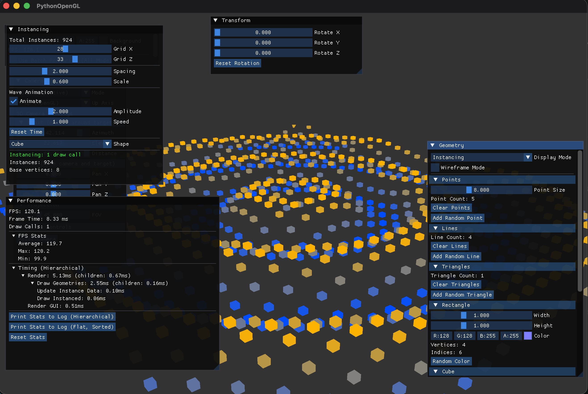

# GitHub Copilotと作る Pythonで OpenGL 3Dプログラミング

## 第11回「インスタンシングで同一形状を大量描画」

[:contents]

### はじめに

前回は **バッチレンダリング** を実装し、複数オブジェクトを1回のドローコールにまとめることで描画パフォーマンスを大幅に向上させました。

今回は **インスタンシング（Instancing）** を実装します。インスタンシングは、**1つのベースジオメトリを N 個のインスタンスとして描画する** 手法です。1000 個の立方体を 1 回のドローコールで描画しながら、CPUの負荷をバッチレンダリングよりもさらに抑えられます。

### バッチレンダリング vs インスタンシング

前回のバッチレンダリングとの違いを整理しておきましょう。

| 方式 | ドローコール | CPU 負荷 | GPU 負荷 | 向いているケース |
|------|-------------|----------|----------|-----------------|
| 個別描画 | N 回 | 低（1オブジェクト分） | 低 | 少数オブジェクト |
| バッチレンダリング | 1 回 | 高（頂点結合を毎フレーム実行） | 低 | 異なる形状の混在 |
| インスタンシング | 1 回 | 低（インスタンスデータのみ更新） | 低〜中 | **同一形状の大量描画** |

**インスタンシングが得意なケース**：
- 草・木・石などの自然物
- パーティクルエフェクト
- 星空・弾丸・敵キャラクターの群れ

### インスタンシングの仕組み

インスタンシングの核心は **「同一の頂点データを繰り返しコピーしない」** という点にあります。

```
バッチレンダリング:
  頂点バッファ = [Cube0の頂点, Cube1の頂点, ... Cube999の頂点]
  → CPU で N 個分の変換行列を適用してから結合

インスタンシング:
  頂点バッファ = [Cube の頂点（1個分のみ）]  ← サイズは1個分
  インスタンスバッファ = [pos0, color0, scale0, pos1, color1, scale1, ...]
  → GPU が 1000 回同じ頂点データを読みつつ、インスタンスデータを切り替える
```

GPU には **「この頂点データを N 回描け。ただし毎回インスタンスデータを1つずつ進めろ」** という命令を1回送るだけです。

#### glVertexAttribDivisor とは

インスタンシングの鍵となる関数です。

```python
# 通常の頂点属性: 1頂点ごとに進める（デフォルト、divisor = 0）
gl.glVertexAttribDivisor(location, 0)

# インスタンス属性: 1インスタンスごとに進める（divisor = 1）
gl.glVertexAttribDivisor(location, 1)
```

`divisor = 1` を設定した属性は、1 インスタンスの描画が終わるごとに次の値に進みます。

#### glDrawElementsInstanced とは

```python
# 通常の描画（1回分）
gl.glDrawElements(gl.GL_TRIANGLES, index_count, gl.GL_UNSIGNED_INT, None)

# インスタンシング描画（N インスタンス分、1回のコールで！）
gl.glDrawElementsInstanced(
    gl.GL_TRIANGLES,
    index_count,       # ベースジオメトリのインデックス数
    gl.GL_UNSIGNED_INT,
    None,
    instance_count     # インスタンス数
)
```

### インスタンシング用シェーダー

インスタンシングでは専用の頂点シェーダーが必要です。インスタンス属性を受け取るために、新しい入力変数を追加します。

`src/shaders/instanced.vert`:

```glsl
#version 330 core

// === 頂点属性（ベースジオメトリ、1頂点ごと） ===
layout (location = 0) in vec3 aPos;      // 頂点座標（ローカル空間）
layout (location = 1) in vec3 aColor;    // 頂点カラー（未使用）

// === インスタンス属性（1インスタンスごと）===
layout (location = 2) in vec3 aInstanceOffset;  // インスタンスの位置
layout (location = 3) in vec3 aInstanceColor;   // インスタンスのカラー
layout (location = 4) in float aInstanceScale;  // インスタンスのスケール

// Uniform変数（全インスタンス共通）
uniform mat4 model;       // グローバル変換行列（全体回転など）
uniform mat4 view;        // View行列
uniform mat4 projection;  // Projection行列

out vec3 vertexColor;

void main()
{
    // 1. ローカル座標にスケールを適用
    vec3 scaledPos = aPos * aInstanceScale;

    // 2. インスタンスのオフセット（位置）を加算 → ワールド座標
    vec3 worldPos = scaledPos + aInstanceOffset;

    // 3. グローバルmodel → View → Projectionで変換
    gl_Position = projection * view * model * vec4(worldPos, 1.0);

    // インスタンスカラーを使用
    vertexColor = aInstanceColor;
}
```

**ポイント**：
- Location 0, 1: 通常の頂点属性（ベースジオメトリ）
- Location 2, 3, 4: インスタンス属性（`glVertexAttribDivisor(location, 1)` が設定される）
- フラグメントシェーダー（`basic.frag`）はそのまま流用

### InstanceRenderer クラスの実装

`src/graphics/instance_renderer.py`:

#### クラス設計

```python
class InstanceRenderer:
    """
    インスタンスレンダリングクラス

    1つのベースジオメトリを N インスタンス分、1回のドローコールで描画する。

    インスタンスVBOの1要素 = 7 floats
      [offset.x, offset.y, offset.z, color.r, color.g, color.b, scale]
    """

    # インスタンスVBO内の各属性のオフセット
    _INSTANCE_STRIDE_FLOATS = 7
    _INSTANCE_OFFSET_OFFSET = 0   # vec3: x, y, z
    _INSTANCE_COLOR_OFFSET  = 3   # vec3: r, g, b
    _INSTANCE_SCALE_OFFSET  = 6   # float: scale

    def __init__(self) -> None:
        self._vao: int = 0
        self._vbo: int = 0           # ベース頂点バッファ
        self._ebo: int = 0           # インデックスバッファ（オプション）
        self._instance_vbo: int = 0  # インスタンスデータバッファ

        self._vertex_count: int = 0
        self._index_count: int = 0
        self._instance_count: int = 0
        self._use_indices: bool = False
```

#### バッファの設定

```python
def set_geometry(self,
                 vertices: np.ndarray,
                 indices: Optional[np.ndarray] = None) -> None:
    """ベースジオメトリを設定する（1個分のみ）"""
    self._vertex_count = len(vertices)
    self._use_indices = indices is not None
    if indices is not None:
        self._index_count = len(indices)
    self._setup_vertex_buffers(vertices, indices)

def set_instances(self,
                  offsets: np.ndarray,
                  colors: np.ndarray,
                  scales: np.ndarray) -> None:
    """インスタンスデータを設定する"""
    instance_data = self._pack_instance_data(offsets, colors, scales)
    self._instance_count = len(offsets)
    self._setup_instance_buffer(instance_data)
```

#### インスタンスデータのパッキング

複数の配列を1つのインタリーブ配列に結合します。

```python
def _pack_instance_data(self,
                        offsets: np.ndarray,
                        colors: np.ndarray,
                        scales: np.ndarray) -> np.ndarray:
    """
    インスタンス属性を1つのインタリーブ配列にパックする

    レイアウト（1インスタンス = 7 floats）:
      [offset.x, offset.y, offset.z, color.r, color.g, color.b, scale]
    """
    n = len(offsets)
    scales_2d = scales.reshape(n, 1) if scales.ndim == 1 else scales
    instance_data = np.hstack([
        offsets.reshape(n, 3),
        colors.reshape(n, 3),
        scales_2d.reshape(n, 1),
    ]).astype(np.float32)
    return instance_data
```

#### 頂点バッファの作成

```python
def _setup_vertex_buffers(self,
                          vertices: np.ndarray,
                          indices: Optional[np.ndarray]) -> None:
    """ベース頂点バッファを作成する"""
    self.cleanup()  # 既存バッファを解放

    self._vao = gl.glGenVertexArrays(1)
    gl.glBindVertexArray(self._vao)

    # --- 頂点 VBO ---
    self._vbo = gl.glGenBuffers(1)
    gl.glBindBuffer(gl.GL_ARRAY_BUFFER, self._vbo)
    gl.glBufferData(
        gl.GL_ARRAY_BUFFER,
        vertices.nbytes,
        vertices.astype(np.float32),
        gl.GL_STATIC_DRAW
    )

    stride = 6 * vertices.itemsize  # 6 floats: x, y, z, r, g, b

    # Location 0: aPos (vec3)
    gl.glEnableVertexAttribArray(0)
    gl.glVertexAttribPointer(
        0, 3, gl.GL_FLOAT, gl.GL_FALSE,
        stride, gl.ctypes.c_void_p(0)
    )

    # Location 1: aColor (vec3)
    gl.glEnableVertexAttribArray(1)
    gl.glVertexAttribPointer(
        1, 3, gl.GL_FLOAT, gl.GL_FALSE,
        stride, gl.ctypes.c_void_p(3 * vertices.itemsize)
    )

    # --- EBO（インデックス使用の場合）---
    if indices is not None and indices.size > 0:
        self._ebo = gl.glGenBuffers(1)
        gl.glBindBuffer(gl.GL_ELEMENT_ARRAY_BUFFER, self._ebo)
        gl.glBufferData(
            gl.GL_ELEMENT_ARRAY_BUFFER,
            indices.nbytes,
            indices.astype(np.uint32),
            gl.GL_STATIC_DRAW
        )

    gl.glBindVertexArray(0)
```

#### インスタンスバッファの作成（ポイント！）

```python
def _setup_instance_buffer(self, instance_data: np.ndarray) -> None:
    """
    インスタンスVBOを作成し、VAOに属性を登録する

    glVertexAttribDivisor(location, 1) により
    attribute が1インスタンスごとに進むように設定する。
    """
    self._instance_vbo = gl.glGenBuffers(1)
    gl.glBindBuffer(gl.GL_ARRAY_BUFFER, self._instance_vbo)
    gl.glBufferData(
        gl.GL_ARRAY_BUFFER,
        instance_data.nbytes,
        instance_data,
        gl.GL_DYNAMIC_DRAW  # 動的更新を想定
    )

    stride = self._INSTANCE_STRIDE_FLOATS * instance_data.itemsize  # 28 bytes

    gl.glBindVertexArray(self._vao)

    # Location 2: aInstanceOffset (vec3)
    offset_bytes = self._INSTANCE_OFFSET_OFFSET * instance_data.itemsize
    gl.glEnableVertexAttribArray(2)
    gl.glVertexAttribPointer(
        2, 3, gl.GL_FLOAT, gl.GL_FALSE,
        stride, gl.ctypes.c_void_p(offset_bytes)
    )
    gl.glVertexAttribDivisor(2, 1)  # ← 1インスタンスごとに進める！

    # Location 3: aInstanceColor (vec3)
    color_bytes = self._INSTANCE_COLOR_OFFSET * instance_data.itemsize
    gl.glEnableVertexAttribArray(3)
    gl.glVertexAttribPointer(
        3, 3, gl.GL_FLOAT, gl.GL_FALSE,
        stride, gl.ctypes.c_void_p(color_bytes)
    )
    gl.glVertexAttribDivisor(3, 1)

    # Location 4: aInstanceScale (float)
    scale_bytes = self._INSTANCE_SCALE_OFFSET * instance_data.itemsize
    gl.glEnableVertexAttribArray(4)
    gl.glVertexAttribPointer(
        4, 1, gl.GL_FLOAT, gl.GL_FALSE,
        stride, gl.ctypes.c_void_p(scale_bytes)
    )
    gl.glVertexAttribDivisor(4, 1)

    gl.glBindVertexArray(0)
    gl.glBindBuffer(gl.GL_ARRAY_BUFFER, 0)
```

**`glVertexAttribDivisor(location, 1)` が重要**：これを設定しないと、インスタンス属性が頂点ごとに進んでしまいます。

#### 描画メソッド

```python
def draw(self) -> None:
    """インスタンシング描画を実行する（1回のドローコール）"""
    if self._vao == 0 or self._instance_count == 0:
        return

    gl.glBindVertexArray(self._vao)

    if self._use_indices and self._index_count > 0:
        gl.glDrawElementsInstanced(
            gl.GL_TRIANGLES,
            self._index_count,
            gl.GL_UNSIGNED_INT,
            None,
            self._instance_count  # ← N個まとめて描画！
        )
    else:
        gl.glDrawArraysInstanced(
            gl.GL_TRIANGLES,
            0,
            self._vertex_count,
            self._instance_count
        )

    gl.glBindVertexArray(0)
```

#### 動的更新（アニメーション対応）

```python
def update_instances(self,
                     offsets: np.ndarray,
                     colors: np.ndarray,
                     scales: np.ndarray) -> None:
    """インスタンスデータを更新する（毎フレーム呼び出し可能）"""
    instance_data = self._pack_instance_data(offsets, colors, scales)
    new_count = len(offsets)

    if new_count != self._instance_count:
        # インスタンス数が変わった場合はバッファを再確保
        self._instance_count = new_count
        gl.glBindBuffer(gl.GL_ARRAY_BUFFER, self._instance_vbo)
        gl.glBufferData(
            gl.GL_ARRAY_BUFFER,
            instance_data.nbytes,
            instance_data,
            gl.GL_DYNAMIC_DRAW
        )
    else:
        # サイズが同じなら部分更新（高速）
        gl.glBindBuffer(gl.GL_ARRAY_BUFFER, self._instance_vbo)
        gl.glBufferSubData(    # ← メモリ再確保なし、高速！
            gl.GL_ARRAY_BUFFER,
            0,
            instance_data.nbytes,
            instance_data
        )

    gl.glBindBuffer(gl.GL_ARRAY_BUFFER, 0)
```

**`glBufferSubData`** を使うことで、バッファのメモリ再確保なしにデータだけ更新できます。これがアニメーション時のパフォーマンスを維持するコツです。

### App への組み込み

`src/core/app.py` でインスタンシングデモを追加します。

#### 初期化

```python
def __init__(self) -> None:
    # ... 既存の初期化 ...

    # インスタンシングデモ
    self._instanced_shader: Shader | None = None
    self._instance_renderer: InstanceRenderer | None = None
    self._instance_count_x = 20         # X方向のグリッド数
    self._instance_count_z = 20         # Z方向のグリッド数
    self._instance_spacing = 2.0        # インスタンス間隔
    self._instance_scale = 0.6          # スケール
    self._instance_wave_amplitude = 2.0 # 波の振幅（Y方向）
    self._instance_wave_speed = 1.0     # 波のアニメーション速度
    self._instance_wave_time = 0.0      # 経過時間
    self._instance_animate = True       # アニメーション有効
    self._instance_shape = 0            # 0: Cube, 1: Sphere
    self._setup_instanced_shader()
    self._setup_instancing()
```

#### インスタンスデータの生成（サイン波グリッド）

```python
def _generate_instance_data(
    self,
    time: float = 0.0
) -> tuple[np.ndarray, np.ndarray, np.ndarray]:
    """グリッド状にインスタンスを配置し、Y方向にサイン波を適用"""
    nx = self._instance_count_x
    nz = self._instance_count_z
    n = nx * nz
    spacing = self._instance_spacing

    center_x = (nx - 1) * spacing * 0.5
    center_z = (nz - 1) * spacing * 0.5

    offsets = np.zeros((n, 3), dtype=np.float32)
    colors  = np.zeros((n, 3), dtype=np.float32)
    scales  = np.full(n, self._instance_scale, dtype=np.float32)

    for iz in range(nz):
        for ix in range(nx):
            idx = iz * nx + ix
            x = ix * spacing - center_x
            z = iz * spacing - center_z

            # 波形でY方向に高さを付ける
            dist = np.sqrt(x * x + z * z)
            y = np.sin(dist * 0.5 - time * self._instance_wave_speed) \
                * self._instance_wave_amplitude

            offsets[idx] = [x, y, z]

            # 高さに応じたカラーグラデーション（青→緑→赤）
            t = (y / (self._instance_wave_amplitude + 1e-6) + 1.0) * 0.5
            colors[idx] = [t, 0.3 + 0.4 * t, 1.0 - t]

    return offsets, colors, scales
```

#### 描画処理

```python
def _draw_instancing_demo(self) -> None:
    """インスタンシングを使用して大量オブジェクトを描画する"""
    if not self._instanced_shader or not self._instance_renderer:
        return

    # アニメーション中はインスタンスデータを毎フレーム更新
    if self._instance_animate:
        offsets, colors, scales = self._generate_instance_data(
            self._instance_wave_time
        )
        with performance_manager.time_operation("Update Instance Data"):
            self._instance_renderer.update_instances(offsets, colors, scales)

    self._instanced_shader.use()

    camera = self._camera_3d if self._use_3d_camera else self._camera_2d

    # グローバルModel行列（回転スライダー対応）
    self._transform.set_model_identity()
    self._transform.rotate_model_x(self._rotation_x)
    self._transform.rotate_model_y(self._rotation_y)
    self._transform.rotate_model_z(self._rotation_z)

    self._instanced_shader.set_mat4("model", self._transform.model)
    self._instanced_shader.set_mat4("view", camera.view_matrix)
    self._instanced_shader.set_mat4("projection", camera.projection_matrix)

    with performance_manager.time_operation("Draw Instanced"):
        self._instance_renderer.draw()  # ← 1回のドローコール！

    performance_manager.set_draw_call_count(1)
```

### imgui でパラメータを操作



スクリーンショットの計測値（924インスタンス、28×33グリッド）：

| 項目 | 値 |
|------|-----|
| FPS | 120.1 |
| Frame Time | 8.33 ms |
| **Draw Calls** | **1** |
| Update Instance Data | 0.10 ms |
| Draw Instanced | 0.06 ms |

Instancing ウィンドウから以下を操作できます：

| パラメータ | 説明 |
|-----------|------|
| Grid X / Z | X・Z 方向のインスタンス数（最大 50x50 = 2500） |
| Spacing | インスタンス間の間隔 |
| Scale | 各インスタンスのスケール |
| Animate | 波アニメーションの ON/OFF |
| Amplitude | 波の高さ |
| Speed | 波のアニメーション速度 |
| Shape | Cube / Sphere の切り替え |

**Draw Calls** が常に `1` であることを Performance ウィンドウで確認できます。

### ユニットテスト

`tests/test_instance_renderer.py` に 19 個のテストを追加しました。

```python
class TestInstanceRendererPackData:
    """_pack_instance_data のテスト"""

    def test_pack_basic(self):
        """基本的なパッキング"""
        renderer = InstanceRenderer()

        offsets = np.array([[1.0, 2.0, 3.0], [4.0, 5.0, 6.0]], dtype=np.float32)
        colors  = np.array([[1.0, 0.0, 0.0], [0.0, 1.0, 0.0]], dtype=np.float32)
        scales  = np.array([0.5, 0.8], dtype=np.float32)

        data = renderer._pack_instance_data(offsets, colors, scales)

        assert data.shape == (2, 7)
        assert data.dtype == np.float32

        # 1番目のインスタンス
        np.testing.assert_array_almost_equal(data[0, :3], [1.0, 2.0, 3.0])  # offset
        np.testing.assert_array_almost_equal(data[0, 3:6], [1.0, 0.0, 0.0]) # color
        assert data[0, 6] == pytest.approx(0.5)                              # scale
```

OpenGL 呼び出しはモックで検証：

```python
def test_draw_calls_instanced(self):
    """draw() が glDrawElementsInstanced を呼ぶ"""
    with patch('src.graphics.instance_renderer.gl') as mock_gl:
        renderer = InstanceRenderer()
        renderer._vao = 1
        renderer._use_indices = True
        renderer._index_count = 36
        renderer._instance_count = 100

        renderer.draw()

        mock_gl.glDrawElementsInstanced.assert_called_once_with(
            mock_gl.GL_TRIANGLES,
            36,
            mock_gl.GL_UNSIGNED_INT,
            None,
            100
        )
```

### 実行方法と動作確認

```bash
# 仮想環境を有効化
source .venv/bin/activate

# 起動
python -m src.main
```

1. **Display Mode** を `Instancing` に切り替え
2. グリッド（20x20 = 400 個）の立方体がサイン波アニメーションで動く
3. **Performance ウィンドウ** で **Draw Calls: 1** を確認
4. Grid X / Z を 50x50（2500 個）に増やしても Draw Calls は 1 のまま

### バッチレンダリングとの比較まとめ

| | バッチレンダリング | インスタンシング |
|--|-------------------|-----------------|
| ドローコール | 1 回 | 1 回 |
| CPU 負荷（静的） | 低（build 済み） | 低 |
| CPU 負荷（動的） | 高（毎フレーム頂点結合） | 低（インスタンスデータのみ） |
| GPU メモリ | N × 頂点データ | 1 × 頂点データ + N × インスタンスデータ |
| 異なる形状の混在 | 可 | 不可（同一形状のみ） |
| インスタンス数の上限 | GPU VRAM による | GPU VRAM による（インスタンスデータが小さい分だけ余裕） |

**結論**: 同一形状を大量に描画する場合は **インスタンシング** が最善策。異なる形状を混在させたい場合は **バッチレンダリング** を使いましょう。

### まとめ

今回実装したものと学んだこと：

#### 実装内容
- **インスタンシング用頂点シェーダー** (`instanced.vert`)
  - Location 2, 3, 4 でインスタンス属性を受け取る
- **InstanceRenderer クラス** (`instance_renderer.py`)
  - `glVertexAttribDivisor` でインスタンス属性を設定
  - `glDrawElementsInstanced` で 1 ドローコール描画
  - `glBufferSubData` で高速な動的更新
- **サイン波グリッドデモ** (`app.py`)
  - 400〜2500 個の立方体/球体をアニメーション
  - imgui でパラメータをリアルタイム調整

#### 学んだこと
1. **インスタンシングはドローコール削減とCPU負荷削減を両立** できる
2. **`glVertexAttribDivisor(location, 1)`** が per-instance 属性の核心
3. **`glBufferSubData`** で動的更新時もバッファ再確保のコストを避けられる
4. 同一形状の大量描画では **インスタンシング > バッチレンダリング**

次回はテクスチャマッピングに進みます。お楽しみに！

---

**前回**: [第10回「バッチレンダリングで描画を高速化」](https://an-embedded-engineer.hateblo.jp/entry/2026/01/03/121748)

**次回**: 第12回「テクスチャマッピング」（準備中）

---

**この記事のコード**: [GitHub - PythonOpenGL Phase 7b](https://github.com/an-embedded-engineer/PythonOpenGL/tree/phase7b/instancing)
